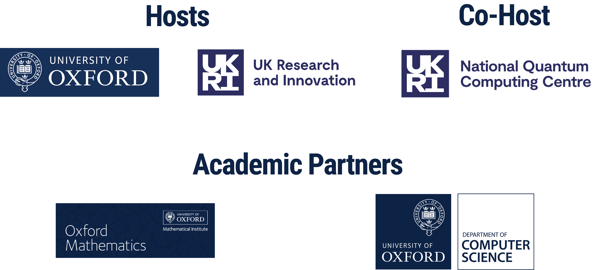

{:.center-image width=100%}

## About QCTiP 2026

We are witnessing impressive progress in quantum hardware development and ongoing theoretical advancements
are bringing practical applications of this hardware closer to reality.
Quantum Computing Theory in Practice (QCTiP) aims to bring together academic community and industry representatives to foster discussions on how to unlock the full potential of quantum computers.

- **Venue:** Mathematical Institute, University of Oxford 
- **Dates:** 20-22 April 2026
- **Focus:** applied aspects of quantum computing theory
- 360 participants
- brings together researchers, practitioners, and industry leaders
- 2 keynote talks, 54 contributed talks
- 3 industry talks, 200 poster presentations

{:.center-image width=100%}

## Key Dates

- **Registration Opening:** TBC
- **Abstract Submission Deadline:** TBC
- **Notification of Acceptance:** TBC
- **Early Bird Registration Deadline:** TBC
- **Conference Dates:** TBC

## Local Organisers

- **B&aacute;lint Koczor** (Mathematical Institute, University of Oxford)
- **Aleks Kissinger** (Computer Science, University of Oxford)

## Programme Committee Chair

- **Richard Kueng** (Johannes Kepler University Linz)

## Steering Committee
- **Ophelia Crawford** (Riverlane)
- **Elham Kashefi** (CNRS & Uni Edinburgh)
- **Jens Eisert** (FU Berlin)
- **Noah Linden** (Uni Bristol)
- **Ashley Montanaro** (Uni Bristol & Phasecraft)

## Code of Conduct

QCTiP2026 is committed to ensuring a harassment-free environment for all attendees, regardless of gender, gender identity and expression, sexual orientation, disability, physical appearance, body size, race, age, religion, or nationality. We maintain a zero-tolerance policy towards harassment in any form. Any participant found violating this code of conduct may face sanctions or expulsion from the conference, at the discretion of the organisers.

<!--
TODO: provide details for reporting CoC violations and getting local support. (see QCTiP 2025 website for example)
-->

## Confirmed Sponsors

{:.center-image width=100%}