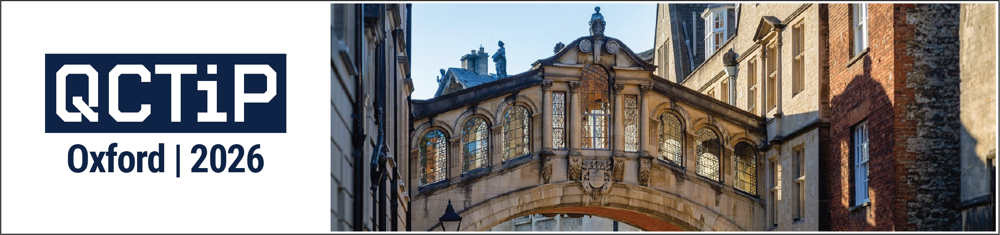

{:.center-image width=100%}

# Keynote Talks
### **Robin Kothari** (Google Quantum AI)
Title: **Multi-qubit Toffoli with exponentially fewer T gates** 
Time: Monday 20th April, 09:40–10:40 
Location: Lecture Theatre L1 
Session chair: Balint Koczor, Aleks Kissinger

### **Simon Benjamin** (University of Oxford and Quantum Motion)
Title: **Pipes, Loops and Snakes: Quantum computing with semiconductor devices** 
Time: Wednesday 22nd April, 09:30–10:30 
Location: Lecture Theatre L1 
Session chair: Laura Herzog

# Industry Talks Session
Time: Tuesday 21st April, 14:00–15:00 
Location: Lecture Theatre L1 
Session chair: Matthias C. Caro

- **Joel Klassen** (Phasecraft)
- **Coral Westoby** (Nu Quantum)
- **Harry Buhrman** (Quantinuum)

# Schedule

<strong>Click here</strong> to open the detailed schedule of the conference progamme in the browser.
 
<iframe src="./Schedule003.pdf" width="100%" height="600px"></iframe>

Alternatively, a PDF of the schedule can be downloaded by clicking [here](./Schedule003.pdf).

# Book of Abstracts

The book of abstracts can be downloaded by clicking [here](./QCTiP2026_Book_of_Abstracts_002.pdf).

# Parallel Sessions Timetable
Click on the relevant session to jump to the list of talks.

|                         |               Lecture Theatre L1             |              Lecture Theatre L2             |
|:-------------:|:-----------------------------------------:|:------------------------------------------:|
| Monday   9:30-10:40 | Welcome + Keynote Robin Kothari | |
| Monday   11:00–12:30       | [Algorithms I -- Optimization](#algorithms-i--optimization) | [QEC I -- Decoders](#qec-i--decoders) |
| Monday   13:30–15:00       | [Algorithms II -- Quantum Chemistry](#algorithms-ii--quantum-chemistry) | [Testing and Verification](#testing-and-verification) |
| Monday   15:30–17:00       | [Learning I](#learning-i) | [Algorithms III -- General](#algorithms-iii--general) |
| Tuesday   09:30–11:00      | [Many-Body Quantum Physics and Information](#many-body-quantum-physics-and-information) | [Compilation and Resource Estimation](#compilation-and-resource-estimation) |
| Tuesday   11:30–13:00      | [Algorithms IV -- Dynamics](#algorithms-iv--dynamics) | [QEC II - Topological Codes](#qec-ii---topological-codes) |
| Tuesday   16:30–18:00      | [Learning II](#learning-ii) | [Benchmarking and Classical Simulation](#benchmarking-and-classical-simulation) |
| Monday   9:30-10:40 | Keynote Simon Benjamin | |
| Wednesday   11:00–12:30       | [Algorithms V -- Hamiltonian Simulation](#algorithms-v--hamiltonian-simulation) | [QEC III -- Fault Tolerance and Compilation](#qec-iii--fault-tolerance-and-compilation) |
| Wednesday   13:30–15:00       | [Fermionic Systems](#fermionic-systems) | [Quantum Control and Emulation](#quantum-control-and-emulation) |
| Wednesday   15:30–17:00       | [Algorithms VI -- Optimization II](#algorithms-vi--optimization-ii) | [QEC IV -- qLDPC Codes](#qec-iv--qldpc-codes) |

# List of Contributed Talks

<strong>Click here</strong> to open or close the list of contributed talks.
 

Names of presenting authors have been _<u>underlined</u>_.

### Algorithms I -- Optimization

_Session Chair: Ashley Montanaro_

- **A Rigorous Quantum Framework for Inequality-Constrained and Multi-Objective Binary Optimization** — Sebastian Egginger, Kristina Kirova, Sonja Bruckner, Stefan Hillmich, _<u>Richard Kueng</u>_

- **A scalable quantum-enhanced greedy algorithm for maximum independent set problems** — _<u>Elisabeth Wybo</u>_, Jami Rönkkö, Olli Hirviniemi, Jernej Rudi Finzgar, Martin Leib

- **Verifiable Quantum Advantage via Optimized DQI Circuits** — _<u>Tanuj Khattar</u>_, Noah Shutty, Craig Gidney, Adam Zalcman, Noureldin Yosri, Dmitri Maslov, Ryan Babbush, Stephen P. Jordan

### QEC I -- Decoders

_Session Chair: Ophelia Crawford_

- **Interpretability of Neural Network Decoders for Fault-Tolerant Quantum Error Correction**, _<u>Lukas Bödeker</u>_, Luc J. B. Kusters, Markus Müller

- **Colour Codes Reach Surface Code Performance using Vibe Decoding** — _<u>Stergios Koutsioumpas</u>_, Tamas Noszko, Hasan Sayginel, Mark Webster, Joschka Roffe

- **Surprisingly useful local decoders for topological codes** — _<u>Nathaniel Selub</u>_

### Algorithms II -- Quantum Chemistry

_Session Chair: Joel Klassen_

- **A comprehensive framework to simulate real-time chemical dynamics on a fault-tolerant quantum computer** — _<u>Karthik Seetharam</u>_, Matteo Lostaglio, Burak Sahinoglu, Sam Pallister, Felipe Jornada

- **Faster Quantum Chemistry Simulations on a Quantum Computer with Improved Tensor Factorization and Active Volume Compilation** — _<u>William Pol</u>_, Sukin Sim, Mark Steudtner, Athena Caesura, Cristian Cortes, Gian-Luca R. Anselmetti, Matthias Degroote, Nikolaj Moll, Raffaele Santagati, Michael Streif, Christofer S. Tautermann

- **Fullqubit alchemist: Quantum algorithm for alchemical free energy calculations** — _<u>Po-Wei Huang</u>_, Gregory Boyd, Gian-Luca R. Anselmetti, Matthias Degroote, Nikolaj Moll, Raffaele Santagati, Michael Streif, Benjamin Ries, Daniel Marti-Dafcik, Hamza Jnane, Sophia Simon, Nathan Wiebe, Thomas R. Bromley, Bálint Koczor

### Testing and Verification

_Session Chair: Hugo Thomas_

- **Composable Verification in the Circuit-Model via Magic-Blindness** — _<u>Sami Abdul Sater</u>_, Harold Ollivier

- **Clifford testing: algorithms and lower bounds** — Marcel Hinsche, Zongbo Bao, _<u>Philippe van Dordrecht</u>_, Jens Eisert, Jop Briët, Jonas Helsen

- **Is it Gaussian? Testing bosonic quantum states** — _<u>Filippo Girardi</u>_, Freek Witteveen, Francesco Anna Mele, Lennart Bittel, Salvatore Francesco Emanuele Oliviero, David Gross, Michael Walter

### Learning I

_Session Chair: Zoltan Zimboras_

- **Cloning is as Hard as Learning for Stabilizer States** — _<u>Nikhil Bansal</u>_, Matthias C. Caro, Gaurav Mahajan

- **Learning T-conjugated stabilizers: The multiple-squares dihedral StateHSP** — _<u>Gideon Lee</u>_, Jonathan A Gross, Masaya Fukami, Zhang Jiang

- **Optimal randomized measurements for a family of non-linear quantum properties** — Zhenyu Du, _<u>Yifan Tang</u>_, Andreas Elben, Ingo Roth, Jens Eisert, Zhenhuan Liu

### Algorithms III -- General

_Session Chair: Viv Kendon_

- **State-to-Hamiltonian conversion with a few copies** — _<u>Kaito Wada</u>_, Jumpei Kato, Hiroyuki Harada, Naoki Yamamoto

- **Randomized Truncation for Quantum State Preparation and Series-Truncated Algorithms** — _<u>Yue Wang</u>_, Xiao-Ming Zhang, Xiao Yuan, Qi Zhao

- **Quantum algorithms through graph composition** — _<u>Arjan Cornelissen</u>_

### Many-Body Quantum Physics and Information

_Session Chair: Linnea Grans-Samuelsson_

- **Computational complexity of Berry phase estimation in topological phases of matter** — _<u>Ryu Hayakawa</u>_, Kazuki Sakamoto, Chusei Kiumi

- **Correcting and extending Trotterized quantum many-body dynamics** — _<u>Gian Gentinetta</u>_, Friederike Metz, Giuseppe Carleo

- **Rapid Mixing of Quantum Gibbs Samplers for Weakly-Interacting Quantum Systems** — _<u>Štěpán Šmíd</u>_, Richard Meister, Mario Berta, Roberto Bondesan

### Compilation and Resource Estimation

_Session Chair: Aleks Kissinger_

- **Characterizing Space Requirements for Quantum Computations via Signaling Conditions** — _<u>Kosuke Matsui</u>_, Jun-Yi Wu, Hayata Yamasaki, Min-Hsiu Hsieh, Mio Murao

- **Compiling Quantum Regular Language States** — _<u>Armando Bellante</u>_, Reinis Irmejs, Marta Florido-Llinàs, María Cea Fernández, Marianna Crupi, Matthew Kiser, J. Ignacio Cirac

- **The FLuid Allocation of Surface code Qubits (FLASQ) cost model for early fault-tolerant quantum algorithms** — _<u>William J. Huggins</u>_, Tanuj Khattar, Amanda Xu, Matthew Harrigan, Christopher Kang, Guang Hao Low, Austin Fowler, Nicholas C. Rubin, Ryan Babbush

### Algorithms IV -- Dynamics

_Session Chair: Oleksandr Kyriienko_

- **Quantum algorithms for general nonlinear dynamics based on the Carleman embedding** — _<u>David Jennings</u>_, Kamil Korzekwa, Matteo Lostaglio, Andrew T Sornborger, Yigit Subasi, Guoming Wang

- **An end-to-end quantum algorithm for nonlinear fluid dynamics with bounded quantum advantage** — David Jennings, _<u>Kamil Korzekwa</u>_, Matteo Lostaglio, Paul Mannix, Richard Ashworth, Emanuele Marsili, Stephen Rolston

- **Optimized quantum algorithms for simulating the Schwinger effect** — Angus Kan, _<u>Jessica Lemieux</u>_, Burak Şahinoğlu, Olga Okrut

### QEC II - Topological Codes

_Session Chair: Michael Vasmer_

- **Rethinking Lattice Surgery Compilation: Diverse Topological Codes and Movable Logical Qubits** — _<u>Laura S. Herzog</u>_, Lucas Berent, Aleksander Kubica, Robert Wille

- **Transversal surface-code game with reconfigurable qubits** — _<u>Shinichi Sunami</u>_, Akihisa Goban, Hayata Yamasaki

- **Logical gates on Floquet codes via folds and twists** — _<u>Alexandra E. Moylett</u>_, Bhargavi Jonnadula

### Learning II

_Session Chair: Thomas Bromley_

- **Shedding light on classical shadows: learning photonic quantum states** — _<u>Hugo Thomas</u>_, Ulysse Chabaud, Pierre-Emmanuel Emeriau

- **Polynomial Speed-Up in Photonic Neural Networks via Adaptive State Injection** — _<u>Léo Monbroussou</u>_, Eliott Z. Mamon, Hugo Thomas, Verena Yacoub, Elham Kashefi

- **Do you know what q-means?** — Alessandro Luongo, _<u>João Doriguello</u>_, Ewin Tang, Arjan Cornelissen

### Benchmarking and Classical Simulation

_Session Chair: Alexandra Moylett_

- **Limitations on Measurement-free Fault-tolerant Protocols using Clifford Circuits** — _<u>Jon Nelson</u>_, Joel Rajakumar, Dominik Hangleiter, Michael Gullans

- **A magic criterion (almost) as nice as PPT, with applications in distillation and detection** — _<u>Zhenhuan Liu</u>_, Tobias Haug, Qi Ye, Zi-Wen Liu, Ingo Roth

- **Fail fast: techniques to probe rare events in quantum error correction** — _<u>Michael Beverland</u>_, Malcolm Carroll, Andrew W. Cross, Ted Yoder

### Algorithms V -- Hamiltonian Simulation

_Session Chair: William Huggins_

- **Quantum singular value transformation without block encodings** — Shantanav Chakraborty, Soumyabrata Hazra, Tongyang Li, Changpeng Shao, _<u>Xinzhao Wang</u>_, Yuxin Zhang

- **Trotter error mitigation by error profiling with shallow quantum circuit** — _<u>Sangjin Lee</u>_, Youngseok Kim, Seung-Woo Lee

- **Trotterization, Operator Scrambling, and Entanglement** — _<u>Tianfeng Feng</u>_, Yue Cao, Qi Zhao

### QEC III -- Fault Tolerance and Compilation

_Session Chair: Michael Beverland_

- **Check-weight-constrained quantum codes: Bounds and examples** — _<u>Lily Wang</u>_, Andy Zeyi Liu, Ray Li, Aleksander Kubica, Shouzhen (Bailey) Gu

- **Fault-tolerant transformations of spacetime codes** — _<u>Arthur Pesah</u>_, Austin K. Daniel, Ilan Tzitrin, Michael Vasmer

- **Automated Compilation Including Dropouts: Tolerating Defective Components in Stabiliser Codes** — _<u>Stasiu Wolanski</u>_

### Fermionic Systems

_Session Chair: Gregory Boyd_

- **The Quantum Paldus Transform: Efficient Circuits with Applications** — _<u>Jedrzej Burkat</u>_, Nathan Fitzpatrick

- **Near-Term Fermionic Simulation with Subspace Noise Tailored Quantum Error Mitigation** — _<u>Miha Papič</u>_, Manuel G. Algaba, Emiliano Godinez-Ramirez, Inés de Vega, Adrian Auer, Fedor Šimkovic IV, Alessio Calzona

- **Matchgate synthesis via Clifford matchgates and T gates** — _<u>Berta Casas</u>_, Paolo Braccia, Élie Gouzien, M. Cerezo, Diego Garcia Martin

### Quantum Control and Emulation

_Session Chair: Mio Murao_

- **Quantum Optimal Control with Geodesic Pulse Engineering** — _<u>Dylan Lewis</u>_, Roeland Wiersema, Sougato Bose

- **Universal Dynamics with Globally Controlled Analog Quantum Simulators** — _<u>Hong-Ye Hu</u>_, Abigail McClain Gomez, Liyuan Chen, Aaron Trowbridge, Andy J. Goldschmidt, Zachary Manchester, Frederic T. Chong, Arthur Jaffe, Susanne F. Yelin

- **A Fast and Frugal Gaussian Boson Sampling Emulator** — _<u>Tom Dodd</u>_, Javier Martínez-Cifuentes, Oliver Thomson Brown, Nicolás Quesada, Raúl García-Patrón

### Algorithms VI -- Optimization II

_Session Chair: Richard Kueng_

- **A quantum analogue of convex optimization** — _<u>Eunou Lee</u>_

- **A measurement-driven quantum algorithm for SAT: Performance guarantees via spectral gaps and measurement parallelization** — Franz J. Schreiber, _<u>Maximilian J. Kramer</u>_, Alexander Nietner, Jens Eisert

- **Grover’s algorithm is an approximation of imaginary-time evolution** — _<u>Yudai Suzuki</u>_, Marek Gluza, Jeongrak Son, Bi Hong Tiang, Nelly H. Y. Ng, Zoë Holmes

### QEC IV -- qLDPC Codes

_Session Chair: Joschka Roffe_

- **Directional Codes: a new family of quantum LDPC codes on hexagonal- and square-grid connectivity hardware** — _<u>Gyorgy Geher</u>_, David Byfield, Archibald Ruban

- **High-performance syndrome extraction circuits for quantum codes** — _<u>Armands Strikis</u>_, Dan Browne, Michael Beverland

- **Computing Efficiently in QLDPC Codes** — _<u>Alexander Malcolm</u>_, Andrew Glaudell, Patricio Fuentes, Daryus Chandra, Alexis Schotte, Colby DeLisle, Rafael Haenel, Amir Ebrahimi, Joschka Roffe, Armanda Quintavalle, Stefanie Beale, Nicholas Lee-Hone, Stephanie Simmons

<!--- 

	### Accepted Contributed Talks
	The below list is not the final programme and subject to confirmation by presenting authors. The length of contributed talks is 30 mins (including questions).

	- **(#14) Directional Codes: a new family of quantum LDPC codes on hexagonal- and square-grid connectivity hardware** --- Gyorgy Geher, David Byfield, Archibald Ruban
	- **(#31) A comprehensive framework to simulate real-time chemical dynamics on a fault-tolerant quantum computer** --- Karthik Seetharam, Matteo Lostaglio, Burak Sahinoglu, Sam Pallister, Felipe Jornada
	- **(#32) Compiling Quantum Regular Language States** --- Armando Bellante, Reinis Irmejs, Marta Florido-Llinàs, María Cea Fernández, Marianna Crupi, Matthew Kiser, J. Ignacio Cirac
	- **(#34) Randomized Truncation for Quantum State Preparation and Series-Truncated Algorithms** --- Yue Wang, Xiao-Ming Zhang, Xiao Yuan, Qi Zhao
	- **(#46) Rapid Mixing of Quantum Gibbs Samplers for Weakly-Interacting Quantum Systems** --- Štěpán Šmíd, Richard Meister, Mario Berta, Roberto Bondesan
	- **(#51) A Rigorous Quantum Framework for Inequality-Constrained and Multi-Objective Binary Optimization** --- Sebastian Egginger, Kristina Kirova, Sonja Bruckner, Stefan Hillmich, Richard Kueng
	- **(#56) The Quantum Paldus Transform: Efficient Circuits with Applications** --- Jedrzej Burkat, Nathan Fitzpatrick
	- **(#61) Logical gates on Floquet codes via folds and twists** --- Alexandra E. Moylett, Bhargavi Jonnadula
	- **(#62) Fault-tolerant transformations of spacetime codes** --- Arthur Pesah, Austin K. Daniel, Ilan Tzitrin, Michael Vasmer
	- **(#64) Polynomial Speed-Up in Photonic Neural Networks via Adaptive State Injection** --- Léo Monbroussou, Eliott Z. Mamon, Hugo Thomas, Verena Yacoub, Elham Kashefi
	- **(#79) Clifford testing: algorithms and lower bounds** --- Marcel Hinsche, Zongbo Bao, Philippe Van Dordrecht, Jens Eisert, Jop Briët, Jonas Helsen
	- **(#81) Optimized quantum algorithms for simulating the Schwinger effect** --- Angus Kan, Jessica Lemieux, Burak Şahinoğlu, Olga Okrut
	- **(#84) Is it Gaussian? Testing bosonic quantum states** --- Filippo Girardi, Freek Witteveen, Francesco Anna Mele, Lennart Bittel, Salvatore Francesco Emanuele Oliviero, David Gross, Michael Walter
	- **(#89) A quantum analogue of convex optimization** --- Eunou Lee
	- **(#96) Computational complexity of Berry phase estimation in topological phases of matter** --- Ryu Hayakawa, Kazuki Sakamoto, Chusei Kiumi
	- **(#99) Quantum singular value transformation without block encodings** --- Shantanav Chakraborty, Soumyabrata Hazra, Tongyang Li, Changpeng Shao, Xinzhao Wang, Yuxin Zhang
	- **(#113) Fullqubit alchemist: Quantum algorithm for alchemical free energy calculations** --- Po-Wei Huang, Gregory Boyd, Gian-Luca R. Anselmetti, Matthias Degroote, Nikolaj Moll, Raffaele Santagati, Michael Streif, Benjamin Ries, Daniel Marti-Dafcik, Hamza Jnane, Sophia Simon, Nathan Wiebe, Thomas R. Bromley, Bálint Koczor
	- **(#123) Grover’s algorithm is an approximation of imaginary-time evolution** --- Yudai Suzuki, Marek Gluza, Jeongrak Son, Bi Hong Tiang, Nelly H. Y. Ng, Zoë Holmes
	- **(#126) Trotter error mitigation by error profiling with shallow quantum circuit** --- Sangjin Lee, Youngseok Kim, Seung-Woo Lee
	- **(#130) Near-Term Fermionic Simulation with Subspace Noise Tailored Quantum Error Mitigation** --- Miha Papič, Manuel G. Algaba, Emiliano Godinez-Ramirez, Inés De Vega, Adrian Auer, Fedor Šimkovic Iv, Alessio Calzona
	- **(#133) Correcting and extending Trotterized quantum many-body dynamics** --- Gian Gentinetta, Friederike Metz, Giuseppe Carleo
	- **(#152) A measurement-driven quantum algorithm for SAT: Performance guarantees via spectral gaps and measurement parallelization** --- Franz J. Schreiber, Maximilian J. Kramer, Alexander Nietner, Jens Eisert
	- **(#156) Faster Quantum Chemistry Simulations on a Quantum Computer with Improved Tensor Factorization and Active Volume Compilation** --- William Pol, Sukin Sim, Mark Steudtner, Athena Caesura, Cristian Cortes, Gian-Luca R. Anselmetti, Matthias Degroote, Nikolaj Moll, Raffaele Santagati, Michael Streif, Christofer S. Tautermann
	- **(#159) Interpretability of Neural Network Decoders for Fault-Tolerant Quantum Error Correction** --- Lukas Bödeker, Luc Kusters, Markus Müller
	- **(#160) Shedding light on classical shadows: learning photonic quantum states** --- Hugo Thomas, Ulysse Chabaud, Pierre-Emmanuel Emeriau
	- **(#164) A Fast and Frugal Gaussian Boson Sampling Emulator** --- Tom Dodd, Javier Martínez-Cifuentes, Oliver Thomson Brown, Nicolás Quesada, Raúl García-Patrón
	- **(#175) A magic criterion (almost) as nice as PPT, with applications in distillation and detection** --- Zhenhuan Liu, Tobias Haug, Qi Ye, Zi-Wen Liu, Ingo Roth
	- **(#182) Quantum algorithms for general nonlinear dynamics based on the Carleman embedding** --- David Jennings, Kamil Korzekwa, Matteo Lostaglio, Andrew T Sornborger, Yigit Subasi, Guoming Wang
	- **(#183) Trotterization, Operator Scrambling, and Entanglement** --- Tianfeng Feng, Yue Cao, Qi Zhao
	- **(#186) Verifiable Quantum Advantage via Optimized DQI Circuits** --- Tanuj Khattar, Noah Shutty, Craig Gidney, Adam Zalcman, Noureldin Yosri, Dmitri Maslov, Ryan Babbush, Stephen P. Jordan
	- **(#187) State-to-Hamiltonian conversion with a few copies** --- Kaito Wada, Jumpei Kato, Hiroyuki Harada, Naoki Yamamoto
	- **(#194) Local active error correction from simulated confinement** --- Ethan Lake
	- **(#195) Characterizing Space Requirements for Quantum Computations via Signaling Conditions** --- Kosuke Matsui, Jun-Yi Wu, Hayata Yamasaki, Min-Hsiu Hsieh, Mio Murao
	- **(#203) Quantum Optimal Control with Geodesic Pulse Engineering** --- Dylan Lewis, Roeland Wiersema, Sougato Bose
	- **(#206) Transversal surface-code game with reconfigurable qubits** --- Shinichi Sunami, Akihisa Goban, Hayata Yamasaki
	- **(#207) An end-to-end quantum algorithm for nonlinear fluid dynamics with bounded quantum advantage** --- David Jennings, Kamil Korzekwa, Matteo Lostaglio, Paul Mannix, Richard Ashworth, Emanuele Marsili, Stephen Rolston
	- **(#230) Colour Codes Reach Surface Code Performance using Vibe Decoding** --- Stergios Koutsioumpas, Tamas Noszko, Hasan Sayginel, Mark Webster, Joschka Roffe
	- **(#242) Matchgate synthesis via Clifford matchgates and T gates** --- Berta Casas, Paolo Braccia, Élie Gouzien, M. Cerezo, Diego Garcia Martin
	- **(#254) Non-variational quantum-enhanced greedy algorithm for solving the maximum independent set problem on large graphs** --- Elisabeth Wybo, Jami Rönkkö, Olli Hirviniemi, Jernej Rudi Finzgar, Martin Leib
	- **(#260) Cloning is as Hard as Learning for Stabilizer States** --- Nikhil Bansal, Matthias C. Caro, Gaurav Mahajan
	- **(#287) Do you know what q-means?** --- Alessandro Luongo, João Doriguello, Ewin Tang, Arjan Cornelissen
	- **(#319) Rethinking Lattice Surgery Compilation: Diverse Topological Codes and Movable Logical Qubits** --- Laura S. Herzog, Lucas Berent, Aleksander Kubica, Robert Wille
	- **(#333) Learning T-conjugated stabilizers: The multiple-squares dihedral StateHSP** --- Gideon Lee, Jonathan A Gross, Masaya Fukami, Zhang Jiang
	- **(#382) Fail fast: techniques to probe rare events in quantum error correction** --- Michael Beverland, Malcolm Carroll, Andrew W. Cross, Ted Yoder
	- **(#428) High-performance syndrome extraction circuits for quantum LDPC codes** --- Armands Strikis, Dan Browne, Michael Beverland
	- **(#429) Universal Dynamics with Globally Controlled Analog Quantum Simulators** --- Hong-Ye Hu, Abigail Mcclain Gomez, Liyuan Chen, Aaron Trowbridge, Andy J. Goldschmidt, Zachary Manchester, Frederic T. Chong, Arthur Jaffe, Susanne F. Yelin
	- **(#473) Automated Compilation Including Dropouts: Tolerating Defective Components in Stabiliser Codes** --- Stasiu Wolanski
	- **(#494) Composable Verification in the Circuit-Model via Magic-Blindness** --- Sami Abdul-Sater, Harold Ollivier
	- **(#509) Computing Efficiently in QLDPC Codes** --- Alexander Malcolm, Andrew Glaudell, Patricio Fuentes, Daryus Chandra, Alexis Schotte, Colby Delisle, Rafael Haenel, Amir Ebrahimi, Joschka Roffe, Armanda Quintavalle, Stefanie Beale, Nichola Lee-Hone, Stephanie Simmons
	- **(#522) Limitations on Measurement-free Fault-tolerant Protocols using Clifford Circuits** --- Jon Nelson, Joel Rajakumar, Dominik Hangleiter, Michael Gullans
	- **(#549) Check-weight-constrained quantum codes: Bounds and examples** --- Lily Wang, Andy Zeyi Liu, Ray Li, Aleksander Kubica, Shouzhen Gu
	- **(#553) Quantum algorithms through graph composition** --- Arjan Cornelissen
	- **(#573) The FLuid Allocation of Surface code Qubits (FLASQ) cost model for early fault-tolerant quantum algorithms.** --- William J. Huggins, Tanuj Khattar, Amanda Xu, Matthew Harrigan, Christopher Kang, Guang Hao Low, Austin Fowler, Nicholas C. Rubin, Ryan Babbush
	- **(#655) Optimal randomized measurements for a family of non-linear quantum properties** --- Zhenyu Du, Yifan Tang, Andreas Elben, Ingo Roth, Jens Eisert, Zhenhuan Liu
--->

# Confirmed Poster Presentations

<strong>Click here</strong> to open or close the list of accepted poster presentations.
 

### Applications of Quantum Computing & Domain Specific Algorithms

#### Poster presentations on Monday 20th April 17:00--18:30 (13 posters)

- **Native linear-optical protocol for efficient multivariate trace estimation** — _<u>Leonardo Novo</u>_, Marco Robbio, Ernesto F. Galvão, Nicolas J. Cerf
- **Quantum Elastic Network Models** — Ioannis Kolotouros, _<u>Adithya Sireesh</u>_, _<u>Stuart Ferguson</u>_, Sean Thrasher, Petros Wallden, Julien Michel
- **Classically trainable architectures for scalable quantum generative modeling** — _<u>Bence Bakó</u>_, Zoltán Kolarovszki, Michał Oszmaniec, Changhun Oh, Zoltán Zimborás
- **Room-Temperature Quantum Reservoir Computing with NV centers in Diamond: Prospects and Limitations** — _<u>Farida Shagieva</u>_, Samuel Tovey, Stefan Prestel
- **Quantum data hiding with two-qubit separable states** — _<u>Donghoon Ha</u>_, Jeong San Kim
- **Fault-Tolerant Quantum Simulation of Pariser–Parr–Pople (PPP) models** — _<u>Mathias Mikkelsen</u>_, Andreas Juul Bay-Smidt, Marcel David Fabian, Srushti Patil, Karim Essafi, Ronin Wu, Gemma Solomon
- **Molecular Ansatz with Quantum Monte Carlo Pre-Screened Givens Rotations** — _<u>Lila Cadi Tazi</u>_, Eline Welling, Alex J.W. Thom, Maria-Andreea Filip
- **A Joint Quantum Computing, Neural Network and Embedding Theory Approach for the Derivation of the Universal Functional** — _<u>Martin Joseph Uttendorfer</u>_, Daniel Barragan-Yani, Matthias Sperl, Marc Landmann
- **Quantum-classical hybrid neural networks for recognizing topological phases of matter** — Markus K. Hoffmann, Leon C. Sander, Colin Scarato, Christoph Hellings, Johannes Knörzer, Andreas Wallraff, Michael J. Hartmann, _<u>Petr Zapletal</u>_
- **Accelerated quantum ground state projection using the wall-Chebyshev expansion** — _<u>Maria-Andreea Filip</u>_, Nathan Fitzpatrick
- **Quantum Simulations of Chemistry in First Quantization with any Basis Set** — _<u>Timothy N. Georges</u>_, Marius Bothe, Christoph Sünderhauf, Bjorn K. Berntson, Róbert Izsák, Aleksei V. Ivanov
- **Learning with Optimized Random Feature: Quantum-Inspired Classical Sampling without Sparsity and Low-Rank Assumptions** — _<u>Natsuto Isogai</u>_, Hayata Yamasaki, Mio Murao
- **Solving the Heat Equation with Quantum Linear System Algorithms** — _<u>Matic Petrič</u>_, René Zander, Diego Polimeni, Tobias Köppl

#### Poster presentations on Tuesday 21st April 15:00--16:30 (13 posters)
- **Quantum block Krylov algorithm for computing low-lying eigenenergies of molecules and materials** — Maria Gabriela Jordao Oliveira, _<u>Nina Glaser</u>_
- **Bridging the Application-Hardware Gap: Domain-Specific Cross-Layer Optimization for Feature Selection on IBM Hardware** — _<u>Mariesa H. Teo</u>_, _<u>Dhirpal Shah</u>_, Simon Martiel, Zachary Morrell, Tina Oberoi, Sarang Joshi, Ryan Robinett, Ali Javadi-Abhari, Kevin J. Sung, Nate Earnest-Noble, Richard R. Allen, Siddhi Ramesh, Dhanvi Bharadwaj, Kairui Zhou, Bharath Thotakura, Colin Campbell, Gokul Subramian Ravi, Aram W. Harrow, Alexander T. Pearson, Samantha J. Riesenfeld, Frederic T. Chong, Teague Tomesh
- **Can Quantum Computing Accelerate Artificial Intelligence** — _<u>Palak Shah</u>_
- **QuLIP: A Variational Quantum Encoder for Vision-Language Understanding** — _<u>Tilen Limback-Stokin</u>_, Tanishka Birdavade, Kin Ian Lo, Mehrnoosh Sadrzadeh
- **Quantum chemistry using quantum linear solvers: prospects of exponential advantage and extension to strong correlation regimes** — _<u>Peniel Tsemo</u>_, Ishita Bhattacharjee, Kenji Sugisaki, Andreas Koehn, Debashis Mukherjee, V. S. Prasannaa
- **Quantum Models for Multi-Stage Compositional Concept Generalization** — _<u>Mina Abbaszadeh</u>_, Matilda Karabina Moore, Mehrnoosh Sadrzadeh, Martha Lewis
- **Entanglement is not sufficient for most practical entanglement-based QKD protocols** — _<u>Shubhayan Sarkar</u>_, Tushita Prasad, Karol Horodecki
- **Quantum Bayesian Optimization for the Automatic Tuning of Lorenz-96 as a Surrogate Climate Model** — _<u>Paul Johann Christiansen</u>_, Daniel Ohl de Mello, Cedric Brügmann, Steffen Hien, Felix Herbort, Martin Kiffner, Lorenzo Pastori, Veronika Eyring, Mierk Schwabe
- **Quantum-enhanced Markov chain Monte Carlo for combinatorial optimization** — _<u>Kate Marshall</u>_, Christa Zoufal, Stefan Woerner
- **GPT on a Quantum Computer** — _<u>Yidong Liao</u>_, Chris Ferrie
- **Variational quantum algorithms for continuum modelling of batteries** — Albert Pool, _<u>Michael Schelling</u>_, Birger Horstmann
- **A New Era of Biomolecular Simulation: Where Quantum Computing Meets GPU-accelerated Supercomputing** — _<u>Tim Weaving</u>_, Alexis Ralli, Tom Bickley, Angus Mingare, Michael Williams De La Bastida, Peter Coveney
- **Direct Energy Gap Calculations in Heisenberg Spin Systems Using Superconducting Quantum Devices** — _<u>Boni Paul</u>_, Sudhindu Bikash Mandal, Dr. Kenji Sugisaki, Prof. Bhanu Pratap Das

### Compilation & Circuit Optimization

#### Poster presentations on Monday 20th April 17:00--18:30 (6 posters)

- **Minimizing CZ gate count for preparation of graph states. Unchanged from previous submission** — _<u>Hemant Sharma</u>_, Adam Burchardt, Kenneth Goodenough, Jonas Helsen
- **Optimal Haar random fermionic linear optics circuits** — Paolo Braccia, N. L. Diaz, Martin Larocca, M. Cerezo, _<u>Diego Garcia Martin</u>_
- **Local Gate Scheduling as a Continuous Quantum Optimal Control Problem** — _<u>Jake Muff</u>_, Francesco Cosco
- **Advantage for Discrete Variational Quantum Algorithms** — _<u>Oleksandr Kyriienko</u>_, Chukwudubem Umeano, Zoë Holmes
- **Circuit Optimization of Qubit IC–POVMs** — _<u>Zhou You</u>_, Qing Liu, You Zhou
- **Quantum Advantage in Resource Estimation** — _<u>William Simon</u>_, Peter J. Love

#### Poster presentations on Tuesday 21st April 15:00--16:30 (6 posters)
- **Optimised Fermion-Qubit Encodings for Reduced Circuit Depth** — _<u>Michael Williams De La Bastida</u>_, Thomas M. Bickley, Peter V. Coveney
- **Multilevel Quantum Circuit Partitioning** — _<u>Felix Burt</u>_, Kuan-Cheng Chen, Kin K. Leung
- **Decomposing diagonal multi-qudit gates** — _<u>Daniele Trisciani</u>_, Samuel Whaite, Zoltan Zimboras
- **Multi-Controlled Quantum Gates in Linear Nearest Neighbor** — _<u>Ben Zindorf</u>_, Sougato Bose
- **Global vs Local encodings for Distributed Quantum Computing** — _<u>Maria Gragera Garces</u>_
- **Reinforcement Learning on Factor–Qubit Bipartite Graphs for T-Gate Optimization in Fault-Tolerant Quantum Circuits** — _<u>Yousra Farhani</u>_, Gemma C. Solomon

### Error Mitigation & Benchmarking

#### Poster presentations on Monday 20th April 17:00--18:30 (8 posters)
- **Noise mitigation of quantum observables via learning from Hamiltonian symmetry decays** — _<u>Javier Oliva del Moral</u>_, Olatz Sanz Larrarte, Joana Fraxanet, Reza Dastbasteh, Dmytro Mishagli, Sergiy Zhuk, Josu Etxezarreta Martinez
- **Circuit Randomization: Optimization Strategies and Performance Benchmarks** — _<u>Alessio Calzona</u>_
- **Error-mitigation aware benchmarking strategy for quantum optimization problems** — Pauline Besserve, _<u>Marine Demarty</u>_, Bo Yang, Kenza Hammam
- **Ansatz-Free Learning of Lindbladian Dynamics In Situ** — _<u>Petr Ivashkov</u>_, Nikita Romanov, Weiyuan Gong, Andi Gu, Hong-Ye Hu, Susanne F. Yelin
- **Unlocking early fault-tolerant quantum computing with mitigated magic dilution** — _<u>Surabhi Luthra</u>_, Alexandra E. Moylett, Dan E. Browne, Earl T. Campbell
- **Phase Shadow: A noise-tolerant path to global quantum property estimation** — _<u>Qingyue Zhang</u>_, Dayue Qin, Zhou You, Feng Xu, Jens Eisert, You Zhou
- **Beyond Hong-Ou-Mandel characterization of multiple single photons** — _<u>Stefan van den Hoven</u>_, Malaquias Correa Anguita, Sara Marzban, Jelmer Renema
- **Quantum Error Correction on Error-mitigated Physical Qubits** — _<u>Minjun Jeon</u>_, Zhenyu Cai

#### Poster presentations on Tuesday 21st April 15:00--16:30 (8 posters)
- **Error mitigation for logical circuits using decoder confidence** — _<u>Maria Dinca</u>_, Tim Chan, Simon Benjamin
- **Reducing measurement error with adaptivity** — _<u>James Byrne</u>_, Noah Linden, Paul Skrzypczyk
- **Robust Lindbladian Estimation for Quantum Dynamics** — Yinchen Liu, _<u>James R. Seddon</u>_, Tamara Kohler, Emilio Onorati, Toby Cubitt
- **Classical Noise Inversion: A Practical and Optimal framework for Robust Quantum Applications** — _<u>Dayue Qin</u>_, Ying Li, You Zhou
- **Lazy Quantum Walks with Multiqubit Gates** — _<u>Steph Foulds</u>_, Viv Kendon
- **Scaling Up Gate Set Tomography: Efficient 4-Qubit Characterisation on Real Quantum Hardware** — _<u>Emiliano Godinez-Ramirez</u>_, Raphael Brieger, Martin Kliesch
- **Characterizing time-dependent noise with compressed sensing** — _<u>Raphael Brieger</u>_, Amin Hosseinkhani
- **Cost-effective scalable quantum error mitigation for tiled Ansätze** — Oskar Graulund Lentz Rasmussen, Erik Kjellgren, Peter Reinholdt, Stephan P. A. Sauer, Sonia Coriani, Jacob Kongsted, _<u>Karl Michael Ziems</u>_

### Hardware, Architectures & Verification

#### Poster presentations on Monday 20th April 17:00--18:30 (4 posters)
- **Efficient certification of intractable quantum states with few Pauli measurements** — _<u>Sami Abdul Sater</u>_, Maxime Garnier, Thierry Martinez, Harold Ollivier, Ulysse Chabaud
- **A resource-efficient quantum-walker Quantum RAM** — Giuseppe De Riso, _<u>Giuseppe Catalano</u>_, Seth Lloyd, Vittorio Giovannetti, Dario De Santis
- **Quantum fanout and GHZ states using isotropic spin-exchange interactions** — _<u>Stephen Fenner</u>_, Rabins Wosti
- **Stoquastic permutationally invariant Bell operators** — _<u>Jan Li</u>_, Owidiusz Makuta, Evert van Nieuwenburg, Jordi Tura

#### Poster presentations on Tuesday 21st April 15:00--16:30 (4 posters)
- **Equivalence of continuous- and discrete-variable gate-based quantum computers with finite energy** — Alex Maltesson, Ludvig Rodung, Niklas Budinger, Giulia Ferrini, _<u>Cameron Calcluth</u>_
- **A Folded Surface Code Architecture for 2D Quantum Hardware** — _<u>Zhu Sun</u>_, Zhenyu Cai
- **Exploiting Physics for Efficient Computing** — _<u>Viv Kendon</u>_, Sampreet Kalita, Ben Butler, Susan Stepney
- **Quantum Channel Certification: Complexity Bounds with and without promises** — _<u>Hirak Ghosh</u>_, Andrew Jackson, Animesh Datta

### Quantum Algorithms

#### Poster presentations on Monday 20th April 17:00--18:30 (21 posters)

- **Quantum Algorithms for the Plasma Physics** — _<u>Matthew Christensen</u>_, Tom Goffrey, Animesh Datta
- **Unified adiabatic and diabatic excited-state description via the ensemble-variational quantum eigensolver** — _<u>Christophe Soule</u>_, Bruno Senjean, Benjamin Lasorne
- **Fast Quantum Many Body state synthesis** — _<u>Prashasti Tiwari</u>_, Sougato Bose, Dylan Lewis
- **Trainability of Parametrised Linear Combinations of Unitaries** — _<u>Nikhil Khatri</u>_, Gabriel Matos, Stefan Zohren
- **Quantum Algorithm for Filtering Eigenvectors** — _<u>Aashna Zade</u>_, Srinivasa Prasannaa, Ermal Rrapaj, Kenneth McElvain, Akshaya Jayashankar
- **Energy landscapes of quantum algorithms in electronic structure and quantum machine learning** — _<u>Choy Boy</u>_, Edoardo Altamura, Dilhan Manawadu, Ivano Tavernelli, Stefano Mensa, David J. Wales
- **A Shadow Enhanced Greedy Quantum Eigensolver** — _<u>Jona Erle</u>_, Bálint Koczor
- **Lindblad engineering for quantum Gibbs state preparation under the eigenstate thermalization hypothesis** — Eric Brunner, Luuk Coopmans, _<u>Gabriel Matos</u>_, Matthias Rosenkranz, Frederic Sauvage, Yuta Kikuchi
- **Do quantum linear solvers offer advantage for networks-based system of linear equations?** — Disha Shetty, Supriyo Dutta, Palak Chawla, Akshaya Jayashankar, Kenji Sugisaki, Jordi Riu, Jan Nogue, _<u>Srinivasa Prasannaa Venkataramanan</u>_
- **Exploring Trainability of Quantum Fourier Models via Data-Tailored Encoding Schemes** — _<u>Felix Paul</u>_, Björn Minneker, Peter Jung
- **Accurate ground state energy estimation with noise and imperfect state preparation** — _<u>Alicja Dutkiewicz</u>_, Thomas E. O'Brien, Stefano Polla
- **Low-depth amplitude estimation via statistical eigengap estimation** — _<u>Po-Wei Huang</u>_, Bálint Koczor
- **Quantum algorithms for equational reasoning** — _<u>Davide Rattacaso</u>_, Daniel Jaschke, Marco Ballarin, Ilaria Siloi, Simone Montangero
- **Faster Quantum Algorithm for Multiple Observables Estimation** — _<u>Yuki Koizumi</u>_, Kaito Wada, Wataru Mizukami, Nobuyuki Yoshioka
- **Quantum Graph Neural Networks with Permutation-Equivariant Message Passing** — Snehal Raj, Brian Coyle, _<u>Léo Monbroussou</u>_, André Juan Ferreira Martins, Renato Farias M. S., Elham Kashefi
- **Practical block encodings of matrix polynomials that can also be trivially controlled** — Martina Nibbi, _<u>Filippo Della Chiara</u>_, Yizhi Shen, Aaron Szasz, Roel Van Beeumen
- **Cross-platform fidelity with local random unitaries** — _<u>Bujiao Wu</u>_, Changrong Xie, Peng Mi, Zhiyi Wu, Zechen Guo, Peisheng Huang, Wenhui Huang, Xuandong Sun, Jiawei Zhang, Libo Zhang, Jiawei Qiu, Xiayu Linpeng, Ziyu Tao, Ji Chu, Ji Jiang, Song Liu, Jingjing Niu, Yuxuan Zhou, Yuxuan Du, Wenhui Ren, Youpeng Zhong, Tongliang Liu, Dapeng Yu
- **Reinforcement Learning for Quantum Chemistry State Preparation** — _<u>Oliver Chapman</u>_, David Tew
- **Sparsity-dependent Complexity Lower Bound of Quantum Linear System Solvers** — _<u>Hitomi Mori</u>_, Yuta Kikuchi, Marcello Benedetti, Matthias Rosenkranz
- **A Quantum Leaky Integrate-and-Fire Spiking Neuron and Network** — _<u>Dean Brand</u>_, Francesco Petruccione
- **Efficient Quantum Laplace Transform: A New Primitive for Quantum Algorithms** — _<u>Julien Zylberman</u>_

#### Poster presentations on Tuesday 21st April 15:00--16:30 (21 posters)
- **Quantifying Entanglement Cost in Quantum State Exchange using Quantum Neural Networks** — Donghwa Ji, Junseo Lee, Myeongjin Shin, IlKwon Sohn, _<u>Kabgyun Jeong</u>_
- **A Monte Carlo approach to bound Trotter error** — Nick S. Blunt, _<u>Aleksei V. Ivanov</u>_, Andreas Juul Bay-Smidt
- **Doktorov Quantum Circuit for Vibronic Spectra: lonization and UV-visible Absorption Applications** — _<u>Renato Olarte Hernandez</u>_
- **A matching decomposition algorithm for simulating quantum walk Hamiltonians** — Mostafa Atallah, _<u>Alvin Gonzales</u>_, Daniel Dilley, Igor Gaidai, Zain H. Saleem, Rebekah Herrman
- **Noise-Assisted Feedback Control of Open Quantum Systems for Ground State Properties** — _<u>Kasturi Ranjan Swain</u>_, Rajesh K. Malla, Adolfo del Campo
- **Sample- and Hardware-Efficient Fidelity Estimation by Stripping Phase-Dominated Magic** — _<u>Guedong Park</u>_, Yong Siah Teo, Hyunseok Jeong
- **Preventing Barren Plateaus in Continuous Quantum Generative Models** — _<u>Olli Hirviniemi</u>_, Afrad Basheer, Thomas Cope
- **qpe-toolbox: Tensor Network Simulation of Quantum Phase Estimation** — Thibaud Louvet, Carlos Ramos Marimón, _<u>Olivier Gauthé</u>_, Benoît Vermersch
- **Quantum algorithm for dephasing of coupled systems: decoupling and IQP duality** — _<u>Sabrina Yue Wang</u>_, Raul A. Santos
- **Quantum Computing with Carbon Nanotubes via Quantum Cellular Automata: Quantum Walks, Variational Algorithms and (1+1)-QED Simulation** — _<u>Andrea Mammola</u>_, Quentin Schaeverbeke, Giuseppe Di Molfetta
- **Variational Quantum Subspace Construction via Symmetry-Preserving Cost Functions** — _<u>Hamzat Akande</u>_, Alexandre Perrin, Bruno Senjean, Matthieu Saubanère
- **An implementation of quantum oracles for the finite element method** — _<u>Sven Danz</u>_, Tobias Stollenwerk, Alessandro Ciani
- **Prospects for quantum advantage in machine learning from the representability of functions** — Sergi Masot-Llima, _<u>Elies Gil-Fuster</u>_, Carlos Bravo-Prieto, Jens Eisert, Tommaso Guaita
- **Fast-forwardable Lindbladians imply quantum phase estimation** — _<u>Zhongxia Shang</u>_, Naixu Guo, Patrick Rebentrost, Alán Aspuru-Guzik, Tongyang Li, Qi Zhao
- **Efficient Eigenstate Preparation in an Integrable Model with Hilbert Space Fragmentation** — _<u>Alejandro Sopena</u>_, Roberto Ruiz, Balazs Pozsgay, Esperanza Lopez
- **HQGA-PFSSP: A Hybrid Quantum Genetic Algorithm for the Permutation Flow Shop Scheduling Problem** — Fadia Boudiaf, Wifak Herkat, _<u>Faicel Hnaien</u>_
- **Concentration-free quantum kernel learning in the Rydberg blockade** — Ayana Sarkar, _<u>Martin Schnee</u>_, Roya Radgohar, Seyedeh Mozhde Fadaie, Victor Drouin-Touchette, Stefanos Kourtis
- **Fermionic Insights into Measurement-Based Quantum Computation: Circle Graph States Are Not Universal Resources** — Brent Harrison, Vishnu Iyer, Ojas Parekh, Kevin Thompson, _<u>Andrew Zhao</u>_
- **Solving larger Travelling Salesman Problem networks with a penalty-free Variational Quantum Algorithm** — _<u>Daniel Goldsmith</u>_, Xing Liang, Dimitrios Makris, Hongwei Wu
- **Improving time dynamics simulation by sampling the error unitary** — Raul Santos Sanhueza, _<u>Lana Mineh</u>_, Adrian Chapman
- **Advancing Quantum Graph Neural Networks via Heat-Kernel Diffusion and Adaptive Residual Connections** — Paul San Sebastian, Tilen Limback-Stokin, Kin Ian Lo, _<u>Theodor Iosif</u>_, Yidong Liao

### Quantum Error Correction & Fault Tolerance

#### Poster presentations on Monday 20th April 17:00--18:30 (14 papers)

- **Benchmarking Decoders for Qudit Error Correction** — _<u>Eleanor Kneip</u>_, Dan Browne
- **Mapping Rotated Surface Codes to 3×N railway** — _<u>Arun John Moncy</u>_, Reza Dastbasteh, Josu Etxezarreta Martinez, Ruben Otxoa de Zuazola
- **Addressable fault-tolerant universal quantum gate operations for high-rate lift-connected surface codes** — Josias Old, Juval Bechar, Markus Müller, _<u>Sascha Heußen</u>_
- **Transversal Clifford-Hierarchy Gates via Non-Abelian Surface Codes** — _<u>Alison Warman</u>_, Sakura Schafer-Nameki
- **Scalable decoding protocols for fast transversal logic in the surface code** — _<u>Mark L. Turner</u>_, Earl T. Campbell, Ophelia Crawford, Neil I. Gillespie, Joan Camps
- **Quantum synchronisation errors: An insertion-deletion equivalence and near-term error correction protocol** — _<u>Lewis Bulled</u>_, Yingkai Ouyang
- **RASCqL: Reaction-limited Architecture for SIMD Complex qLDPC Logic** — _<u>Willers Yang</u>_, Jason Chadwick, Mariesa Teo, Joshua Viszlai, Fred Chong
- **Quantum error correction via logical state purification** — _<u>Chandrima Pushpan</u>_, Tanoy Kanti Konar, Aditi Sen De, Amit Kumar Pal
- **Making Better Quality GKP Magic States by Error Correcting Cat and Fock States** — _<u>Sharon David</u>_, Francesco Arzani, Jack Davis, Ulysse Chabaud
- **Correcting quantum errors using a classical code and one additional qubit** — _<u>Tenzan Araki</u>_, Joseph Goodwin, Zhenyu Cai
- **A 2d×d×d Spacetime Volume Implementation of a Logical S Gate in the Surface Code** — _<u>Yuga Hirai</u>_, Shota Ikari, Yosuke Ueno, Yasunari Suzuki
- **Quant low-density lattice codes** — Timo Hillmann, Jens Eisert, _<u>Francesco Arzani</u>_
- **Demonstration of measurement-free universal fault-tolerant quantum computation** — _<u>Robert Freund</u>_, Friederike Butt, Ivan Pogorelov, Alex Steiner, Marcel Meyer, Thomas Monz, Markus Müller
- **A Bravyi-König theorem for Floquet codes based on conjugate stabiliser groups** — _<u>Jelena Mackeprang</u>_, Jonas Helsen

#### Poster presentations on Tuesday 21st April 15:00--16:30 (14 papers)
- **Quantum Error-Corrected Computation of Molecular Energies** — Kentaro Yamamoto, Yuta Kikuchi, Natalie Brown, _<u>David Muñoz Ramo</u>_, David Amaro
- **Bias-tailored Time-dynamic Bacon-Shor codes** — _<u>Esha Swaroop</u>_, Fernando Pastawski, Joe Iverson
- **Fair Baselines and True Thresholds for Bivariate Bicycle Codes** — _<u>Tushar Pandey</u>_
- **A matching decoder for bivariate bicycle codes** — _<u>Kaavya Sahay</u>_, Dominic J. Williamson, Benjamin J. Brown
- **Quantum origami: High-rate quantum memory with addressable logic on Quantinuum ion trap processors** — Elijah Durso-Sabina, _<u>Esha Swaroop</u>_, Natalie Brown, David Stephen, Andrew Potter
- **A memory-efficient, symbolic and exact simulator for quantum error correction** — _<u>George Umbrarescu</u>_, David Amaro
- **Entanglement boosting: low-volume and high-yield logical entanglement generation** — _<u>Shinichi Sunami</u>_, Yutaka Hirano, Toshihide Hinokuma, Hayata Yamasaki
- **Minimizing the Number of Code Switching Operations in Fault-Tolerant Quantum Circuits** — _<u>Erik Weilandt</u>_, Tom Peham, Robert Wille
- **Fault Tolerance by Construction: Synthesis and Optimisation for the Steane Code** — Benjamin Rodatz, _<u>Boldizsár Poór</u>_, Aleks Kissinger
- **Bayesian Optimization for Quantum Error-Correcting Code Discovery** — Yihua Chengyu, _<u>Richard Meister</u>_, Conor Carty, Sheng-Ku Lin, Roberto Bondesan
- **Quantum low-density lattice codes** — Timo Hillmann, Jens Eisert, _<u>Francesco Arzani</u>_
- **Decoding with alternating weighted graph sparsification for quantum low-density parity-check codes** — _<u>Josu Etxezarreta Martinez</u>_, Reza Dastbasteh, Ruben Otxoa
- **Magic state distillation with permutation-invariant codes and a two-qubit example** — _<u>Yingkai Ouyang</u>_
- **Algorithmic Impact of Near-Term Error Correction on Iterative Quantum Phase Estimation under Circuit-Level Noise** — _<u>Leon C. Sander</u>_, Dustin Seboldt, Michael J. Hartmann

### Quantum Simulation (Digital & Analog)

#### Poster presentations on Monday 20th April 17:00--18:30 (10 posters)

- **Provably efficient quantum thermal state preparation via local driving** — _<u>Dominik Hahn</u>_, S. A. Parameswaran, Benedikt Placke
- **How an Equi-ensemble Description Systematically Outperforms the Weighted-ensemble Variational Quantum Eigensolver** — _<u>Akilan Rajamani</u>_, Martin Beseda, Benjamin Lasorne, Bruno Senjean
- **Probing dynamical freezing in programmable Rydberg atom arrays** — _<u>Madhumita Sarkar</u>_, Ben Zindorf, Bhaskar Mukherjee, Sougato Bose, Roopayan Ghosh
- **Beyond Born-Oppenheimer: Nonequilibrium Electron-Nuclear Dynamics on Quantum Computers** — _<u>Arta Schellhorn</u>_, Juliane Heitkämper, Alejandro Somoza, Birger Horstmann
- **Quantum-inspired classical simulation through randomized time evolution** — _<u>Fredrik Hasselgren</u>_, Bálint Koczor
- **Toward excited-state quantum dynamics with state-average orbital-optimized VQE** — _<u>Bruno Senjean</u>_, Benjamin Lasorne, Saad Yalouz, Martin Beseda, Silvie Illesova
- **Quantum Simulation with Gauge Symmetries: From Error Mitigation to Error Correction** — _<u>Julius Mildenberger</u>_, Luca Spagnoli, Philipp Hauke, Alessandro Roggero
- **Tensor Network Born Machines: Measurement-Driven Generative Model for Quantum Data** — _<u>Mattia Robbiano</u>_, Stefano Mangini, Michele Grossi
- **From Fermions to Qubits: A ZX-Calculus Perspective** — _<u>Haytham McDowall-Rose</u>_, Razin Shaikh, Lia Yeh
- **Semidefinite Programming Hierarchies for Quantum Spin Systems** — _<u>Ali Almasi</u>_, Peter Brown, Dávid Bugár, Cambyse Rouzé

#### Poster presentations on Tuesday 21st April 15:00--16:30 (9 posters)
- **Fast convergence of Majorana Propagation for weakly interacting fermions** — _<u>Giorgio Facelli</u>_, Hamza Fawzi, Omar Fawzi
- **First-Quantised Electron Scattering Simulations on Trapped-Ion Quantum Hardware** — _<u>Chiara Leadbeater</u>_, Nathan Fitzpatrick, David Muñoz Ramo, Alex J. W. Thom
- **Green’s function quantum impurity solvers on neutral‑atom arrays with realistic noise** — _<u>Janik Kramer</u>_, Piero Naldesi, Andreas Kruckenhauser
- **Randomised measurements of a disorder-induced entanglement transition in a neutral atom quantum processor** — _<u>Oscar Scholin</u>_, Apollonas S. Matsoukas-Roubeas, Lucas Sá, Alexei Bylinskii, Andrew Daley, Dorian Gangloff
- **Hermitian Matrix Product Operators on Quantum Computers** — _<u>Naivasha Williams</u>_, Prof. Andrew Green
- **Classical Simulation of Noiseless Quantum Dynamics without Randomness** — Jue Xu, Chu Zhao, Xiangran Zhang, Shuchen Zhu, Qi Zhao, Presenting: _<u>Yue Wang</u>_
- **Efficient Simulation of Sparse, Non-Local Fermion Models** — _<u>Reinis Irmejs</u>_, Ignacio Cirac
- **Probabilistic Computing Optimization of Complex Spin-Glass Topologies** — _<u>Fredrik Hasselgren</u>_, Max Al-Hasso, Amy Searle, Joseph Tindall, Marko von der Leyen
- **Distant Bell State via Measured Spin Chain Dynamics** — _<u>Ralph Jason Costales</u>_, Sougato Bose

### Theory of Near-Term Quantum Computing

#### Poster presentations on Monday 20th April 17:00--18:30 (4 posters)

- **Variations learning on sparse graphs** — _<u>Helene M. Lösl</u>_, Aydin Deger, Andrew J. Daley
- **Optimal cutting of bosonic circuit** — _<u>Shao-Hua Hu</u>_, Jun-Yi Wu, Ray-Kuang Lee
- **Robust Classical Shadows via Shadow-Aware M-Estimation** — _<u>Ethan Feldman</u>_
- **The Trainer–Encoder Interaction Matrix: A Framework for Analysing Inductive Bias in Quantum Fourier Models** — _<u>Kyle James Stuart Campbell</u>_, Luigi Del Debbio, Petros Wallden

#### Poster presentations on Tuesday 21st April 15:00--16:30 (4 posters)
- **On the stability to noise of fermion to qubit mappings** — Guillermo González García, Filippo Maria Gambetta, _<u>Raul A. Santos</u>_
- **Stratified Sampling for Quasi-Probability Decompositions** — _<u>Joshua Dai</u>_, Bálint Koczor
- **Entanglement-assisted circuit knitting: distributed quantum computing using limited entanglement resources** — _<u>Shao-Hua Hu</u>_, Po-Sung Liu, Jun-Yi Wu
- **The Power of Lie-Algebraic Classical Simulation for Quantum Mean Values** — _<u>Adelina Bärligea</u>_, Jakob S. Kottmann

<!--- 

The below list is not final and subject to confirmation by presenting authors. 

-   **(1) Optimising quantum data hiding** --- Francesco Anna Mele, Ludovico Lami
-   **(8) Efficient Qubit Routing for Diverse Quantum ISAs via Canonical Representation** --- Zhaohui Yang, Kai Zhang, Xinyang Tian, Xiangyu Ren, Yingjian Liu, Yunfeng Li, Dawei DIng, Jianxin Chen, Yuan Xie
-   **(10) Phase Shadow: A noise-tolerant path to global quantum property estimation** --- Qingyue Zhang, Dayue Qin, Zhou You, Feng Xu, Jens Eisert, You Zhou
-   **(16) Stability of digital and analog quantum simulations under noise** --- Jayant Rao, Jens Eisert, Tommaso Guaita
-   **(17) Demonstration of measurement-free universal fault-tolerant quantum computation** --- Robert Freund, Friederike Butt, Ivan Pogorelov, Alex Steiner, Marcel Meyer, Thomas Monz, Markus Müller
-   **(20) Verifiable blind observable estimation** --- Bo Yang, Elham Kashefi, Harold Ollivier
-   **(23) Encoding molecular structures in quantum machine learning** --- Choy Boy, Edoardo Altamura, Dilhan Manawadu, Ivano Tavernelli, Stefano Mensa, David J. Wales
-   **(24) Quantum algorithms for equational reasoning** --- Davide Rattacaso, Daniel Jaschke, Marco Ballarin, Ilaria Siloi, Simone Montangero
-   **(27) A scalable advantage in multi-photon quantum machine learning** --- Tobias Haug, Yong Wang, Zhenghao Yin, Ciro Pentangelo, Simone Piacentini, Andrea Crespi, Francesco Ceccarelli, Roberto Osellame, Philip Walther
-   **(28) Classical Noise Inversion: A Practical and Optimal framework for Robust Quantum Applications** --- Dayue Qin, Ying Li, You Zhou
-   **(30) Estimating applied potentials in cold atom lattice simulators** --- Bhavik Kumar, Daniel Malz
-   **(33) Equivalence of continuous- and discrete-variable gate-based quantum computers with finite energy** --- Alex Maltesson, Ludvig Rodung, Niklas Budinger, Giulia Ferrini, Cameron Calcluth
-   **(37) Preparing low-variance states using a distributed quantum algorithm** --- Xiaoyu Liu, Benjamin F. Schiffer, Jordi Tura
-   **(38) State-average orbital-optimized VQE for excited-state quantum chemistry** --- Bruno Senjean, Benjamin Lasorne, Saad Yalouz, Martin Beseda, Silvie Illesova
-   **(40) Power and Limitations of Linear Programming Decoder for Quantum LDPC Codes** --- Shouzhen (Bailey) Gu, Mehdi Soleimanifar
-   **(41) Sparsity-dependent Complexity Lower Bound of Quantum Linear System Solvers** --- Hitomi Mori, Yuta Kikuchi, Marcello Benedetti, Matthias Rosenkranz
-   **(43) Statistical Signatures of Barren Plateaus Beyond Observable Concentration** --- Zi-Shen Li, Bujiao Wu, Xiao-Wei Li, Wenkang Weng
-   **(44) Fast-forwardable Lindbladians imply quantum phase estimation** --- Zhongxia Shang, Naixu Guo, Patric Rebentrost, Al´an Aspuru-Guzik, Tongyang Li, Qi Zhao
-   **(45) Classical Simulation of Noiseless Quantum Dynamics without Randomness** --- Jue Xu, Chu Zhao, Xiangran Zhang, Shuchen Zhu, Qi Zhao
-   **(47) Native Measurement Based Variational Ansatze: Design and Analysis** --- Rajarsi Pal, Harold Ollivier, Marta Leonetti
-   **(50) Sample-Optimal Fidelity Estimation via Nonlinear Post-Processing of Pauli Measurements** --- Guedong Park, Yong Siah Teo, Hyunseok Jeong
-   **(52) An implementation of quantum oracles for the finite element method** --- Sven Danz, Tobias Stollenwerk, Alessandro Ciani
-   **(54) Efficient graph-diagonal characterization of noisy states distributed over quantum networks via Bell sampling** --- Zherui Wang, Joshua Carlo A. Casapao, Naphan Benchasattabuse, Ananda G. Maity, Jordi Tura, Akihito Soeda, Michal Hajdušek, Rodney Van Meter, David Elkouss
-   **(55) Efficient Learning Algorithms for Structured Bosonic and Fermionic Unitary Operators** --- Marco Fanizza, Vishnu Iyer, Junseo Lee, Antonio Anna Mele, Francesco Anna Mele
-   **(59) Average-computation benchmarking for local expectation values in digital quantum devices** --- Flavio Baccari, Pavel Kos, Georgios Styliaris
-   **(60) Lazy Quantum Walks with Native Multiqubit Gates** --- Steph Foulds, Viv Kendon
-   **(69) Efficient Characterization of Coherent and Correlated Low-Degree Noise in Layers of Gates** --- Marianna Crupi, Ignacio Cirac, Flavio Baccari
-   **(73) A memory-efficient, symbolic and exact simulator of universal quantum programs** --- George Umbrarescu, David Amaro
-   **(74) Quantum algorithm for dephasing of coupled systems: decoupling and IQP duality** --- Sabrina Yue Wang, Raul A. Santos
-   **(75) Dequantization and Hardness of Spectral Sum Estimation** --- Roman Edenhofer, Atsuya Hasegawa, François Le Gall
-   **(77) A Folded Surface Code Architecture for 2D Quantum Hardware** --- Zhu Sun, Zhenyu Cai
-   **(80) Circuit-Efficient Randomized Quantum Simulation of Non-Unitary Dynamics with Observable-Driven and Symmetry-Aware Designs** --- SONGQINGHAO YANG, Jinpeng Liu
-   **(82) The table maker's quantum search** --- Stefanos Kourtis
-   **(86) Power and limitations of distributed quantum state purification** --- Benchi Zhao, Yu-Ao Chen, Xuanqiang Zhao, Chengkai Zhu, Giulio Chiribella, Xin Wang
-   **(88) Universal digital quantum computation with global control in superconducting architectures** --- Roberto Menta, Francesco Cioni, Riccardo Aiudi, Ashkan Abedi, Guido Menichetti, Francesco Caravelli, Marco Polini, Vittorio Giovannetti
-   **(90) The symplectic rank of non-Gaussian quantum states** --- Francesco Anna Mele, Salvatore Francesco Emanuele Oliviero, Varun Upreti, Ulysse Chabaud
-   **(92) Cost-effective scalable quantum error mitigation for tiled Ansätze** --- Oskar Graulund Lentz Rasmussen, Erik Kjellgren, Peter Reinholdt, Stephan P. A. Sauer, Sonia Coriani, Jacob Kongsted, Karl Michael Ziems
-   **(93) Achievable rates in non-asymptotic bosonic quantum communication** --- Francesco Anna Mele, Giovanni Barbarino, Vittorio Giovannetti, Marco Fanizza
-   **(94) Classically trainable architectures for scalable quantum generative modeling** --- Bence Bakó, Zoltán Kolarovszki, Michał Oszmaniec, Changhun Oh, Zoltán Zimborás
-   **(97) Quantum synchronisation errors: An insertion-deletion equivalence and near-term error-correction protocol** --- Lewis Bulled, Yingkai Ouyang
-   **(101) Efficient Simulation of Sparse, Non-Local Fermion Models** --- Reinis Irmejs, Ignacio Cirac
-   **(102) Do quantum linear solvers offer quantum advantage for networks-based system of linear equations?** --- Disha Shetty, Supriyo Dutta, Palak Chawla, Akshaya Jayashankar, Kenji Sugisaki, Jordi Riu, Jan Nogue, Srinivasa Prasannaa V
-   **(105) Cross-platform fidelity with local random unitaries** --- Bujiao Wu, Changrong Xie, Peng Mi, Zhiyi Wu, Zechen Guo, Peisheng Huang, Wenhui Huang, Xuandong Sun, Jiawei Zhang, Libo Zhang, Jiawei Qiu, Xiayu Linpeng, Ziyu Tao, Ji Chu, Ji Jiang, Song Liu, Jingjing Niu, Yuxuan Zhou, Yuxuan Du, Wenhui Ren, Youpeng Zhong, Tongliang Liu, Dapeng Yu
-   **(107) Scalable decoding protocols for fast transversal logic in the surface code** --- Mark L. Turner, Earl T. Campbell, Ophelia Crawford, Neil I. Gillespie, Joan Camps
-   **(108) Heisenberg-limited and low-depth amplitude estimation from ancilla-free statistical phase estimation** --- Po-Wei Huang, Bálint Koczor
-   **(109) When quantum resources backfire: Non-gaussianity and symplectic coherence in noisy bosonic circuits** --- Varun Upreti, Ulysse Chabaud, Zoë Holmes, Armando Angrisani
-   **(110) Entanglement Detection with Variational Quantum Interference: Theory and Experiment** --- Rui Zhang, Zhenhuan Liu, Chendi Yang, Yue-Yang Fei, Xu-Fei Yin, Yingqiu Mao, Li Li, Nai-Le Liu, Yu-Ao Chen, Jian-Wei Pan
-   **(111) How an Equi-ensemble Description Systematically Outperforms the Weighted-ensemble Variational Quantum Eigensolver** --- Akilan Rajamani, Martin Beseda, Benjamin Lasorne, Bruno Senjean
-   **(112) Advantage for Discrete Variational Quantum Algorithms in Circuit Recompilation** --- Oleksandr Kyriienko, Chukwudubem Umeano, Zoë Holmes
-   **(116) Optimal Haar random fermionic linear optics circuits** --- Paolo Braccia, N. L. Diaz, Martin Larocca, M. Cerezo, Diego Garcia Martin
-   **(117) A Joint Quantum Computing, Neural Network and Embedding Theory Approach for the Derivation of the Universal Functional** --- Martin Joseph Uttendorfer, Daniel Barragan-Yani, Matthias Sperl, Marc Landmann
-   **(118) Hamiltonian learning via quantum Zeno effect** --- Giacomo Franceschetto, Egle Pagliaro, Leonardo Zambrano, Luciano Pereira, Antonio Acín
-   **(119) Solving larger Travelling Salesman Problem networks with a penalty-free Variational Quantum Algorithm** --- Daniel Goldsmith, Xing Liang, Dimitrios Makris, Hongwei Wu
-   **(125) Efficient LCU block encodings and polynomial transformations that can also be trivially controlled** --- Martina Nibbi, Filippo Della Chiara, Yizhi Shen, Aaron Szasz, Roel Van Beeumen
-   **(128) From Fermions to Qubits: A ZX-Calculus Perspective** --- Haytham McDowall-Rose, Razin Shaikh, Lia Yeh
-   **(131) Pauli Propagation: A Computational Framework for Simulating Quantum Systems** --- Manuel S. Rudolph, Tyson Jones, Yanting Teng, Armando Angrisani, Zoë Holmes
-   **(134) Entanglement as a probe to the robustness of topological quantum codes** --- Harikrishnan K J, Amit Kumar Pal
-   **(141) Nonlinear photonic architecture for fault-tolerant quantum computing** --- Maike Ostmann, Joshua Nunn, Alexander Jones
-   **(142) On the stability to noise of fermion to qubit mappings** --- Guillermo González García, Filippo Maria Gambetta, Raul A. Santos
-   **(144) Generalized cross-resonance scheme for maximally-entangling two-qutrit gates** --- Yash Saxena, Tharrmashastha SAPV, Sagnik Chatterjee, Ray-Kuang Lee
-   **(148) Variational quantum algorithms for continuum modelling of batteries** --- Albert Pool, Michael Schelling, Birger Horstmann
-   **(149) Concentration-Free Quantum Kernel Learning in the Rydberg Blockade** --- Ayana Sarkar, Martin Schnee, Roya Radgohar, Seyedeh Mozhde Fadaie, Victor Drouin-Touchette, Stefanos Kourtis
-   **(163) A Quantum Gate Architecture via Teleportation and Entanglement** --- Callum Duncan, Samuel Sheldon, Pieter Kok
-   **(165) Hybrid Quantum-Classical Algorithms for Molecular Vibronic Spectroscopy: Theory, Implementation, and Applications to UV-Visible Absorption and Electronic Circular Dichroism** --- Renato Olarte Hernandez
-   **(169) Correcting quantum errors using a classical code and one additional qubit** --- Tenzan Araki, Joseph Goodwin, Zhenyu Cai
-   **(170) A partition function framework for estimating logical error curves in stabilizer codes** --- Linnea Grans-Samuelsson, Leon Wichette, Hans Hohenfeld, Elie Mounzer
-   **(176) Logical accreditation: a framework for efficient certification of fault-tolerant computations** --- James Mills, Adithya Sireesh, Dominik Leichtle, Joschka Roffe, Elham Kashefi
-   **(177) Fault Tolerance by Construction: Synthesis and Optimisation for the Steane Code** --- Benjamin Rodatz, Boldizsár Poór, Aleks Kissinger
-   **(178) Stochastic Time-Evolved Quantum-Selected Configuration Interaction for Embedded Multiscale Molecular Simulation** --- Tim Weaving, Alexis Ralli, Tom Bickley, Angus Mingare, Michael Williams De La Bastida, Peter Coveney
-   **(179) Quantum low-density lattice codes** --- Timo Hillmann, Jens Eisert, Francesco Arzani
-   **(181) Efficient Eigenstate Preparation in an Integrable Model with Hilbert Space Fragmentation** --- Alejandro Sopena, Roberto Ruiz, Balazs Pozsgay, Esperanza Lopez
-   **(185) Variational quantum algorithms with exact geodesic transport** --- André Juan Ferreira-Martins, Renato Farias M. S., Giancarlo Camilo, Thiago O. Maciel, Allan Tosta, Ruge Lin, Abdulla Alhajri, Tobias Haug, Leandro Aolita
-   **(193) How "Quantum" is your Quantum Computer? Macrorealism-based Benchmarking via Mid-Circuit Parity Measurement** --- Lorenzo Braccini, Sougato Bose, Ben Zindorf, Debarshi Das
-   **(196) Measuring Multiparticle Indistinguishability with the Generalized Bunching Probability** --- Shawn Geller, Emanuel Knill
-   **(204) On the emergence of quantum memory in non-Markovian dynamics** --- Alexander Yosifov, Aditya Iyer, Vlatko Vedral, jinzhao sun
-   **(215) Reducing quantum resources for observable estimation with window-assisted coherent QPE** --- Harriet Apel, Cristian L Cortes, Jessica Lemieux, Mark Steudtner
-   **(218) Stabilizer-based quantum simulation of fermion dynamics with local qubit encodings** --- Anthony Gandon, Samuele Piccinelli, Jannes Nys, Ivano Tavernelli
-   **(219) Addressable fault-tolerant universal gate operations for high-rate lift-connected surface codes** --- Josias Old, Juval Bechar, Markus Müller, Sascha Heußen
-   **(221) Quantum Graph Neural Networks with Permutation-Equivariant Message Passing** --- Snehal Raj, Brian Coyle, Léo Monbroussou, André Juan Ferreira Martins, Renato Farias M. S., Elham Kashefi
-   **(225) Simulation of noisy quantum circuits using frame representations** --- Janek Denzler, Jose Carrasco, Jens Eisert, Tommaso Guaita
-   **(227) On Estimating Quantum Divergences with $p$-Power Means** --- Jinge Bao, Minbo Gao, Qisheng Wang
-   **(231) Towards Efficient Quantum Thermal State Preparation via Local Driving: Lindbladian Simulation with Provable Guarantees** --- Dominik Hahn, S. A. Parameswaran, Benedikt Placke
-   **(237) Accelerated quantum ground state projection using the wall-Chebyshev expansion** --- Maria-Andreea Filip, Nathan Fitzpatrick
-   **(239) Ladder Operator Block-Encoding** --- Carter M. Gustin, William A. Simon, Kamil Serafin, Alexis Ralli, Gary R. Goldstein, Peter J. Love
-   **(241) A Bravyi-König theorem for Floquet codes generated by locally conjugate stabiliser groups** --- Jelena Mackeprang, Jonas Helsen
-   **(245) Flag at origin: a modular fault-tolerant preparation for CSS codes** --- Diego Forlivesi, David Amaro
-   **(248) Prospects for quantum advantage in machine learning from the representability of functions** --- Sergi Masot-Llima, Elies Gil-Fuster, Carlos Bravo-Prieto, Jens Eisert, Tommaso Guaita
-   **(258) Fast convergence of Majorana Propagation for weakly interacting fermions** --- Giorgio Facelli, Hamza Fawzi, Omar Fawzi
-   **(261) Quantum lattice Boltzmann method for several time steps: A local Carleman linearization algorithm** --- Antonio David Bastida Zamora, Ljubomir Budinski, Valtteri Lahtinen, Pierre Sagaut
-   **(262) Entanglement boosting: low-volume and high-yield logical entanglement generation** --- Shinichi Sunami, Yutaka Hirano, Toshihide Hinokuma, Hayata Yamasaki
-   **(274) Multi-Controlled Quantum Gates in Linear Nearest Neighbor** --- Ben Zindorf, Sougato Bose
-   **(276) A Solovay-Kitaev theorem for quantum signal processing** --- Zane Rossi
-   **(290) Quantum chemistry using quantum linear solvers: extension to strong correlation regimes and prospects of polynomial advantag** --- Peniel Tsemo, Ishita Bhattacharjee, Kenji Sugisaki, Andreas Koehn, Debashis Mukherjee, V. S. Prasannaa
-   **(301) Quantum Advantage in Resource Estimation** --- William Simon, Peter J. Love
-   **(308) Energy-independent tomography of Gaussian states** --- Lennart Bittel, Francesco Anna Mele, Jens Eisert, Antonio Anna Mele
-   **(311) Leveraging Symmetries in Pauli Propagation** --- Yanting Teng, Su Yeon Chang, Manuel S. Rudolph, Zoë Holmes
-   **(313) Transversal Clifford-Hierarchy Gates via Non-Abelian Surface Codes** --- Alison Warman, Sakura Schafer-Nameki
-   **(314) Faster Quantum Algorithm for Multiple Observables Estimation** --- Yuki Koizumi, Kaito Wada, Wataru Mizukami, Nobuyuki Yoshioka
-   **(317) Temporal quantum interference in many-body programmable Rydberg atom arrays** --- Madhumita Sarkar, Ben Zindorf, Bhaskar Mukherjee, Sougato Bose, Roopayan Ghosh
-   **(318) Quantum Elastic Network Models and their Application to Graphene** --- Ioannis Kolotouros, Adithya Sireesh, Stuart Ferguson, Sean Thrasher, Petros Wallden, Julien Michel
-   **(325) Quantum-enhanced Markov Chain Monte Carlo for Combinatorial Optimization** --- Kate Marshall, Christa Zoufal, Stefan Woerner
-   **(335) How much can we learn from quantum random circuit sampling?** --- Tudor Manole, Daniel K. Mark, Wenjie Gong, Bingtian Ye, Yury Polyanskiy, Soonwon Choi
-   **(339) Entanglement-assisted circuit knitting: distributed quantum computing using limited entanglement resources** --- ShaoHua Hu, Po-Sung Liu, Jun-Yi Wu
-   **(340) Trainability of Parameterised Linear Combinations of Unitaries** --- Nikhil Khatri, Gabriel Matos, Stefan Zohren
-   **(343) A resource-efficient quantum-walker Quantum RAM** --- Giuseppe De Riso, Giuseppe Catalano, Seth Lloyd, Vittorio Giovannetti, Dario De Santis
-   **(344) Error-mitigation aware benchmarking strategy for quantum optimization problems** --- Pauline Besserve, Marine Demarty, Bo Yang, Kenza Hammam
-   **(346) Efficient Quantum Laplace Transforms: A New Primitive for Quantum Algorithms** --- Julien Zylberman
-   **(348) Native linear-optical protocol for efficient multivariate trace estimation** --- Leonardo Novo, Marco Robbio, Ernesto F. Galvão, Nicolas J. Cerf
-   **(354) Lindbladian Simulation with Logarithmic Precision Scaling via Two Ancillae** --- Wenjun Yu, Xiaogang Li, Qi Zhao, Xiao Yuan
-   **(361) Distance-Preserving Unitary Encoding of Pauli States in Surface Codes** --- Luis Colmenarez, Florian Marquardt, Remmy Zen, Jan Olle, Markus Müller
-   **(362) Fast Quantum Many Body State Synthesis** --- Prashasti Tiwari, Sougato Bose, Dylan Lewis
-   **(368) Quantum block Krylov subspace projector: a quantum algorithm for computing low-lying eigenenergies of molecules and materials** --- Maria Gabriela Jordao Oliveira, Nina Glaser
-   **(370) Improving time dynamics simulation by sampling the error unitary** --- Raul Santos Sanhueza, Lana Mineh, Adrian Chapman
-   **(374) Efficient certification of intractable quantum states with few Pauli measurements** --- Sami Abdul Sater, Maxime Garnier, Thierry Martinez, Harold Ollivier, Ulysse Chabaud
-   **(380) A competitive NISQ and qubit-efficient solver for the LABS problem** --- Marco Sciorilli, Giancarlo Camilo, Thiago O. Maciel, Lucas Borges, Askery Canabarro, Leandro Aolita
-   **(381) Bridging the Application-Hardware Gap: Domain-Specific Cross-Layer Optimization for Feature Selection on IBM Hardware** --- Mariesa H. Teo, Dhirpal Shah, Simon Martiel, Zachary Morrell, Tina Oberoi, Sarang Joshi, Ryan Robinett, Ali Javadi-Abhari, Kevin J. Sung, Nate Earnest-Noble, Richard R. Allen, Siddhi Ramesh, Dhanvi Bharadwaj, Kairui Zhou, Bharath Thotakura, Colin Campbell, Gokul Subramian Ravi, Aram W. Harrow, Alexander T. Pearson, Samantha J. Riesenfeld, Frederic T. Chong, Teague Tomesh
-   **(385) Robust Lindbladian Estimation for Quantum Dynamics** --- Yinchen Liu, James R. Seddon, Tamara Kohler, Emilio Onorati, Toby Cubitt
-   **(416) Variational Learning with Long-Entangling Gates** --- Helene M. Lösl, Aydin Deger, Andrew J. Daley
-   **(419) Optimised Fermion-Qubit Encodings for Quantum Simulation with Reduced Circuit Depth** --- Michael Williams De La Bastida, Thomas M. Bickley, Peter V. Coveney
-   **(425) A quantum generative learning model using distinguishable expectation values** --- Olli Hirviniemi, Afrad Basheer, Thomas Cope
-   **(432) Quantum embedding of graphs for subgraph counting** --- Bibhas Adhikari
-   **(437) Quantum machine learning advantages beyond hardness of evaluation** --- Riccardo Molteni, Simon Marshall, Vedran Dunjko
-   **(442) A Multilevel Framework for Partitioning Quantum Circuits** --- Felix Burt, Kuan-Cheng Chen, Kin K. Leung
-   **(462) Learning mixed quantum states in large-scale experiments** --- Matteo Votto, Marko Ljubotina, Cécilia Lancien, J. Ignacio Cirac, Peter Zoller, Maksym Serbyn, Lorenzo Piroli, Benoît Vermersch
-   **(465) Error mitigation for logical circuits using decoder confidence** --- Maria Dinca, Tim Chan, Simon Benjamin
-   **(479) Quantum Counting in the Rydberg Blockade** --- Joseph Gibson, Victor Drouin-Touchette, Stefanos Kourtis
-   **(487) Minimizing the Number of Code Switching Operations in Fault-Tolerant Quantum Circuits** --- Erik Weilandt, Tom Peham, Robert Wille
-   **(500) In the shadow of the Hadamard test: Using the garbage state for good and further modifications** --- Paul K. Faehrmann, Jens Eisert, Richard Kueng
-   **(514) Noise mitigation of quantum observables via learning from Hamiltonian symmetry decays** --- Javier Oliva del Moral, Olatz Sanz Larrarte, Joana Fraxanet, Reza Dastbasteh, Dmytro Mishagli, Sergiy Zhuk, Josu Etxezarreta Martinez
-   **(540) Quantum Error Correction on Error-mitigated Physical Qubits** --- Minjun Jeon, Zhenyu Cai
-   **(543) QuIC: Quantum-Inspired Compound Adapters for Parameter Efficient Fine-Tuning** --- Snehal Raj, Brian Coyle
-   **(556) Lindblad engineering for quantum Gibbs state preparation under the eigenstate thermalization hypothesis** --- Eric Brunner, Luuk Coopmans, Gabriel Matos, Matthias Rosenkranz, Frederic Sauvage, Yuta Kikuchi
-   **(592) On a Quantum Runtime Advantage for all Computation** --- Mischa Woods
-   **(619) Trade-offs Between Chemical Accuracy and Algorithmic Resources in Transcorrelated Quantum Chemistry** --- Cheng-Lin Hong, Emiel Koridon, Paul Faehrmann, Stefano Polla, Werner Dobrautz
-   **(3) Global vs Local encodings for Distributed Quantum Computing** --- Maria Gragera Garces
-   **(4) A 2d×d×d Spacetime Volume Implementation of a Logical S Gate in the Surface Code** --- Yuga Hirai, Shota Ikari, Yosuke Ueno, Yasunari Suzuki
-   **(9) Quantum origami: High-rate quantum memory with addressable logic on Quantinuum ion trap processors** --- Elijah Durso-Sabina, Esha Swaroop, Natalie Brown, David Stephen, Andrew Potter
-   **(10) Bias-tailored Time-dynamic Bacon-Shor codes** --- Esha Swaroop, Fernando Pastawski, Joe Iverson
-   **(11) Double-Bracket Algorithmic Cooling** --- Mohammed Alghadeer, Khanh Uyen Giang, Shuxiang Cao, Simone D. Fasciati, Michele Piscitelli, Nelly Ng, Peter J. Leek, Marek Gluza, Mustafa Bakr
-   **(13) Quantum Simulations of Chemistry in First Quantization with any Basis Set** --- Timothy N. Georges, Marius Bothe, Christoph Sünderhauf, Bjorn K. Berntson, Róbert Izsák, Aleksei V. Ivanov
-   **(14) Gate Teleportation vs Circuit Cutting in Distributed Quantum Computing** --- Daniel Dilley, Shobhit Gupta, Nikolay Sheshko, Alvin Gonzales, Manish K. Singh, Zain Saleem
-   **(16) Unlocking early fault-tolerant quantum computing with mitigated magic dilution** --- Surabhi Luthra, Alexandra E. Moylett, Dan E. Browne, Earl T. Campbell
-   **(20) A Quantum Leaky Integrate-and-Fire Spiking Neuron and Network** --- Dean Brand, Francesco Petruccione
-   **(21) Reducing measurement error with adaptivity** --- James Byrne, Noah Linden, Paul Skrzypczyk
-   **(22) Quantum signal processing for non-Hermitian matrices** --- Xabier Gutiérrez, Lorenzo Laneve, Mikel Sanz
-   **(23) Fault-Tolerant Quantum Simulation of Pariser–Parr–Pople (PPP) models** --- Mathias Mikkelsen, Andreas Juul Bay-Smidt, Marcel David Fabian, Srushti Patil, Karim Essafi, Ronin Wu, Gemma Solomon
-   **(24) Noise-Assisted Feedback Control of Open Quantum Systems for Ground State Properties** --- Kasturi Ranjan Swain, Rajesh K. Malla, Adolfo del Campo
-   **(25) Stratification for Quasi-Probability Decomposition Methods** --- Joshua Dai
-   **(27) Quantum Computing with Carbon Nanotubes via Quantum Cellular Automata: Quantum Walks, Variational Algorithms and (1+1)-QED Simulation** --- Andrea Mammola, Quentin Schaeverbeke, Giuseppe Di Molfetta
-   **(29) Quantum error correction via purification using a single auxiliary** --- Chandrima Pushpan, Tanoy Kanti Konar, Aditi Sen De, Amit Kumar Pal
-   **(31) Circuit Randomization: Optimization Strategies and Performance Benchmarks** --- Alessio Calzona
-   **(33) Molecular Ansatz with Quantum Monte Carlo Pre-Screened Givens Rotations** --- Lila Cadi Tazi, Eline Welling, Alex J.W. Thom, Maria-Andreea Filip
-   **(34) Fermionic Insights into Measurement-Based Quantum Computation: Circle Graph States Are Not Universal Resources** --- Brent Harrison, Vishnu Iyer, Ojas Parekh, Kevin Thompson, Andrew Zhao
-   **(36) QuSquare: Scalable Quality-Oriented Benchmark Suite for Pre-Fault-Tolerant Quantum Devices** --- David Aguirre, Ruben Peña, Mikel Sanz
-   **(38) Beyond Hong-Ou-Mandel characterization of multiple single photons** --- Stefan van den Hoven, Malaquias Correa Anguita, Sara Marzban, Jelmer Renema
-   **(40) A Monte Carlo approach to bound Trotter error** --- Nick S. Blunt, Aleksei V. Ivanov, Andreas Juul Bay-Smidt
-   **(43) Quantum Error-Corrected Computation of Molecular Energies** --- Kentaro Yamamoto, Yuta Kikuchi, Natalie Brown, David Muñoz Ramo, David Amaro
-   **(45) Practical ansatz-free Lindbladian learning** --- Petr Ivashkov, Nikita Romanov, Weiyuan Gong, Andi Gu, Hong-Ye Hu, Susanne F. Yelin
-   **(46) Measurement-Relative Circuit Reduction from Stabilizer Constraints** --- Rajarsi Pal, Harold Ollivier
-   **(48) Characterizing time-dependent noise with compressed sensing** --- Raphael Brieger, Amin Hosseinkhani
-   **(49) Decoding with alternating weighted graph sparsification for quantum low-density parity-check codes** --- Josu Etxezarreta Martinez, Reza Dastbasteh, Ruben Otxoa
-   **(50) Scaling Up Gate Set Tomography: Efficient 4-Qubit Characterisation on Real Quantum Hardware** --- Emiliano Godinez-Ramirez, Raphael Brieger, Martin Kliesch
-   **(51) Minimizing CZ gate count for preparation of graph states** --- Hemant Sharma, Adam Burchardt, Kenneth Goodenough, Jonas Helsen
-   **(52) Direct Energy Gap Calculations in Heisenberg Spin Systems Using Superconducting Quantum Devices** --- Boni Paul, Sudhindu Bikash Mandal, Dr. Kenji Sugisaki, Prof. Bhanu Pratap Das
-   **(54) Early fault-tolerant resource estimation for ground-state preparation via Lindblad simulation** --- Marius Bothe, Nick Blunt
-   **(55) Decomposing diagonal multi-qudit gates** --- Daniele Trisciani, Samuel Whaite, Zoltan Zimboras
-   **(57) Can Quantum Computing Accelerate Artificial Intelligence** --- Palak Shah
-   **(60) Circuit optimization of informationally complete positive operator–valued qubit measurements** --- Zhou You, Qing Liu, You Zhou
-   **(63) Algorithmic Impact of Near-Term Error Correction on Iterative Quantum Phase Estimation under Circuit-Level Noise** --- Leon C. Sander, Dustin Seboldt, Michael J. Hartmann
-   **(65) First-Quantised Electron Scattering Simulations on Trapped-Ion Quantum Hardware** --- Chiara Leadbeater, Nathan Fitzpatrick, David Muñoz Ramo, Alex J. W. Thom
-   **(66) Entanglement is not sufficient for most practical entanglement-based QKD protocols** --- SHUBHAYAN SARKAR, Tushita Prasad, Karol Horodecki
-   **(67) Tensor Network Born Machines: Measurement-Driven Generative Model for Quantum Data** --- Mattia Robbiano, Stefano Mangini, Michele Grossi
-   **(70) Simulating Quantum Walk Hamiltonians without Pauli Decomposition** --- Mostafa Atallah, Alvin Gonzales, Daniel Dilley, Igor Gaidai, Zain H. Saleem, Rebekah Herrman
-   **(72) Optimal cutting of bosonic circuit** --- Shao-Hua Hu, Jun-Yi Wu, Ray-Kuang Lee
-   **(73) Quantum Algorithms for Approximate Graph Isomorphism Testing** --- Prateek P. Kulkarni
-   **(74) Mapping Rotated Surface Codes to 3 × N railway** --- Arun John Moncy, Reza Dastbasteh, Josu Etxezarreta Martinez, Ruben Otxoa de Zuazola
-   **(75) Green’s function quantum impurity solvers on neutral-atom arrays with realistic noise** --- Janik Kramer, Piero Naldesi, Andreas Kruckenhauser
-   **(76) Randomised measurements of a disorder-induced entanglement transition in a neutral atom quantum processor** --- Oscar Scholin, Apollonas S. Matsoukas-Roubeas, Lucas Sá, Alexei Bylinskii, Andrew Daley, Dorian Gangloff
-   **(79) Quantum-inspired classical simulation through randomized time evolution** --- Fredrik Hasselgren, Balint Koczor
-   **(80) Joint Input-Parameter Harmonic Representations of Quantum Fourier Models** --- Kyle James Stuart Campbell, Luigi Del Debbio, Petros Wallden
-   **(81) Decoding bivariate bicycle codes using symmetries** --- Kaavya Sahay, Dominic J. Williamson, Benjamin J. Brown
-   **(82) A Shadow Enhanced Greedy Quantum Eigensolver** --- Jona Erle, Balint Koczor
-   **(84) Quantum Models for Multi-Stage Compositional Concept Generalization** --- Mina Abbaszadeh, Matilda Karabina Moore, Mehrnoosh Sadrzadeh, Martha Lewis
-   **(85) Quantum Simulation with Gauge Symmetries: From Error Mitigation to Error Correction** --- Julius Mildenberger, Luca Spagnoli, Philipp Hauke, Alessandro Roggero
-   **(87) Magic States with the Gottesman-Kitaev-Preskill Code** --- Sharon David, Francesco Arzani, Jack Davis, Ulysse Chabaud
-   **(88) Exploring Trainability of Quantum Fourier Models via Data-Tailored Encoding Schemes** --- Felix Paul, Björn Minneker, Peter Jung
-   **(89) Quantum fanout and GHZ states using isotropic spin-exchange interactions** --- Stephen Fenner, Rabins Wosti
-   **(90) Bayesian Optimization for Quantum Error-Correcting Code Discovery** --- Yihua Chengyu, Richard Meister, Conor Carty, Sheng-Ku Lin, Roberto Bondesan
-   **(91) Parallelization of Dissipative Quantum Algorithms** --- Sudatta Hor, Yongshan Ding
-   **(92) Benchmarking Tools for Qudit Codes** --- Eleanor Kneip
-   **(93) Robust Classical Shadows via Shadow-Aware M-Estimation** --- Ethan Feldman
-   **(94) qpe-toolbox: Tensor Network Simulation of Quantum Phase Estimation** --- Thibaud Louvet, Carlos Ramos Marimón, Olivier Gauthé, Benoît Vermersch
-   **(95) Distant Bell State via Measured Spin Chain Dynamics** --- Ralph Jason Costales, Sougato Bose
-   **(96) Channel Testing Under a Depolarizing Promise** --- Hirak Ghosh, Andrew Jackson, Animesh Datta
-   **(99) Barren Explanations: A No-Go Theorem for Explainable Universal Quantum Classifiers** --- Sharvil Saxena
-   **(100) Local Gate Scheduling as a Continuous Quantum Optimal Control Problem** --- Jake Muff, Francesco Cosco
-   **(101) QuLIP: A Compositional Variational Quantum Encoder for Vision-Language Understanding** --- Tilen Limback-Stokin, Tanishka Birdavade, Kin Ian Lo, Mehrnoosh Sadrzadeh
-   **(102) Stoquastic permutationally invariant Bell operators** --- Jan Li, Owidiusz Makuta, Evert van Nieuwenburg, Jordi Tura
-   **(104) Learning with Optimized Random Feature: Quantum-Inspired Classical Sampling without Sparsity and Low-Rank Assumptions** --- Natsuto Isogai, Hayata Yamasaki, Mio Murao
-   **(105) Quantum Algorithm for the Vlasov-Maxwell System** --- Matthew Christensen, Tom Goffrey, Animesh Datta
-   **(106) SDP Hierarchies for Quantum Spin Systems** --- Ali Almasi, Peter Brown, Dávid Bugár, Cambyse Rouzé
-   **(107) Hermitian Matrix Product Operators on Quantum Computers** --- Naivasha Williams, Prof. Andrew Green
-   **(108) Parameterised graph theory for tensor networks: rerouting entanglement, simplifying structure, and tomography** --- Natalie McHugh, Matthias C. Caro, Sergii Strelchuk
-   **(109) The HHL algorith, with qutrits.** --- Tushti Patel, V.S. Prasannaa
-   **(112) Accurate ground state energy estimation with noise and imperfect state preparation** --- Alicja Dutkiewicz, Thomas E. O'Brien, Stefano Polla
-   **(113) Advancing Quantum Graph Neural Networks via Heat-Kernel Diffusion and Adaptive Residual Connections** --- Paul San Sebastian, Tilen Limback-Stokin, Kin Ian Lo, Theodor Iosif, Yidong Liao
-   **(114) GPT on a Quantum Computer** --- Yidong Liao, Chris Ferrie
-   **(116) Fast Lie-Algebraic Simulation of Structured Quantum Circuits: Implementation and Applications** --- Adelina Bärligea, Jakob S. Kottmann
-   **(117) RASCqL: Reaction-limited Architecture for SIMD Complex qLDPC Logic** --- Willers Yang, Jason Chadwick, Mariesa Teo, Joshua Viszlai, Fred Chong
-   **(118) Quantum Algorithm for Filtering Eigenvectors** --- Aashna Zade, Srinivasa Prasannaa, Ermal Rrapaj, Kenneth McElvain, Akshaya Jayashankar
--->

# Acknowledgements
Many thanks to Viet Tran (Johannes Kepler University Linz, Austria),
Po-Wei Huang and Abhishek Rajput (University of Oxford) for their help in managing
submissions and scheduling the scientific programme.
