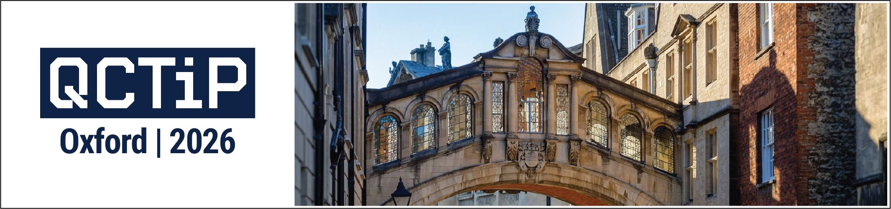

{:.center-image width=100%}

# QCTiP 2026 Registration

A registration link will be made available here after registration opens. Please note that **tickets will be sold on a first-come first-served basis**
and based on the interest in previous QCTiP editions, we expect tickets may sell out before registration closes.

### Key Dates

- **Registration Opening:** TBC
- **Early Bird Registration Deadline:** TBC
- **College Accommodation Booking closes:** Monday 23rd February at 9am
- **Conference Dates:** 20-22 April 2026

# Accommodation

## Important notice

A major event, the [Skoll World Forum](https://skoll.org/) will take place later the same week as QCTiP 2026 in central Oxford.
While Skoll does not directly affect the main QCTiP event in the Mathematical Institute, accommodation will be more difficult to find
for the night of Tuesday the 21st April and after. For this reason we **strongly recommend that participants purchase a ticket for QCTiP as soon as possible
and then book accommodation immediately after purchasing a ticket**. 

## St Anne's College 

{:.center-images}

We have reserved a limited number of rooms at St Anne's College that participants can book via
[St Anne's College's website](https://www.st-annes.ox.ac.uk/conferences-bb/accommodation/book-conference/) using the below code.

Use this code: **QCTIP44815**

Dates available are 19th April (check in) - 22nd April (check out).
Please note that the **booking link will expire on Monday 23rd February at 9am** and therefore bookings must be made before this date.
St Anne's College is located "just opposite the street", 3 mins walk from the conference venue. 

## Holiday Inn Oxford Pear Tree

{:.center-images}

We have reserved a limited number of rooms at the Holiday Inn Oxford which participants can book
by clicking on the link below (or by choosing "Group Rate" and providing the code "GV3").

[**Book a room**](https://www.ihg.com/hotels/gb/en/find-hotels/select-roomrate?qDest=Oxford, United Kingdom&qPt=CASH&qCiD=19&qCoD=23&qCiMy=032026&qCoMy=032026&qAdlt=1&qChld=0&qRms=1&qAAR=6CBARC&qGrpCd=GV3&qSlH=OFDUK&srb_u=1&qSrt=sAV&qBrs=6c.hi.ex.sb.ul.ic.cp.cw.in.vn.cv.rs.ki.kd.ma.sp.va.re.vx.nd.sx.we.lx.rn.sn.nu.ge&qWch=0&qSmP=0&qRad=30&qRdU=mi&setPMCookies=false&qpMbw=0&qErm=false&qpMn=1&qRmFltr=)

Dates available are 19th April (check in) - 23rd April (check out).
Please note that the **minimum stay lenght is 3 days and that the rooms are only held until 5th March 2026**,
and therefore bookings must be made before this date.

The conference venue is conveniently
accessible via a 10-min bus trip from the [Pear Tree Park and Ride](https://maps.app.goo.gl/p32tLLjf7Vrv8pEe9) bus station.
Participants should take bus number 300 which stops immediately in front
of the Andrew Wiles Building (name of the bus stop is Radcliffe Observatory Quarter).

## Recommended Hotels

A list of recommended hotels will be made available here closer to the conference dates.

# Visa Information

International attendees should check UK visa requirements well in advance. Please do get in touch in case you require an invitation letter.

