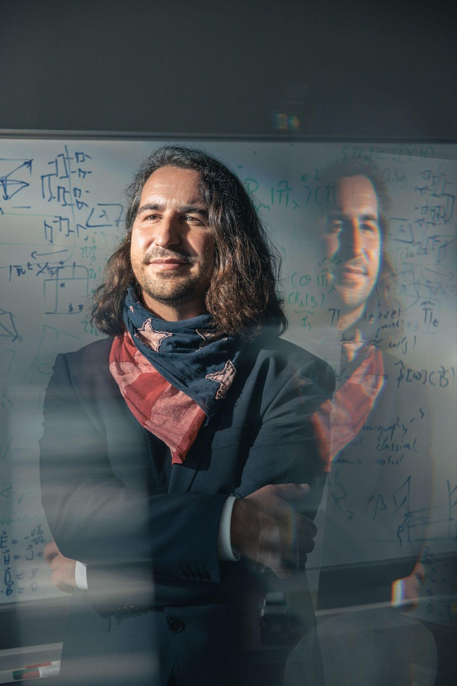

{:.center-image width=100%}

# QCTiP 2026 Call for Submissions

Talks will be selected based on their scientific excellence,
fit to the workshop theme, and overall programme balance.
Submissions are expected that report on recent advances in
quantum information and computation.

Topics of interest include, but are not limited to:
- Applications of quantum computers
- Architectures for quantum computing
- Quantum algorithms
- Quantum compilation and circuit optimization
- Quantum error correction and fault tolerance
- Digital and analog simulation of quantum systems
- Theory of near-term quantum computing
- Verification of quantum software and hardware
- Error mitigation and benchmarking

**All submissions must be made online via the following link** [LINK will be added imminently].

### Talk Submissions Format

A contributed talk submission must include a full technical manuscript
containing all technical details of the work.
While manuscripts available on online repositories such as arXiv are acceptable,
a PDF copy must still be uploaded. Only original research papers will be considered;
survey papers, PhD theses, and white papers are not eligible.

**Submissions must include the following two PDFs**
- a self-contained 3-page extended abstract
- a technical manuscript that should ideally be available on the arXiv

The program committee will base their decisions largely on the extended abstract,
but may review the full paper at their discretion. If your submission comprises
multiple papers, please combine them into a single PDF file.
Submissions must be complete and include sufficient information
to allow verification of results.

Presenters are expected to attend the workshop in person and therefore
need to make sure to purchase a ticket before the registration deadline.
Submissions not selected for talks may be offered the opportunity to
present as posters, unless deemed out of scope by the programme committee.

### Poster Only Submission

If you intend to submit a poster-only contribution, please select
the poster track during submission. A brief abstract of 1-3 pages
is sufficient for poster submissions.

# Key Dates

- **Talk Submission Opening:** TBC
- **Talk Submission Deadline:** 11 January 2026
- **Poster Submission Deadline:** 25 January 2026
- **Notification of Acceptance:** 20 February 2026
- **Conference Dates:** 20-22 April 2026

# Programme Committee

### Programme Committee Chair

	 
**Richard Kueng** (Johannes Kepler University Linz, Austria)

Richard Kueng pursues an interdisciplinary research agenda at the interface between
computer science (algorithms & computational complexity), physics
(quantum information & quantum technologies) and applied math (convex geometry & high
dimensional probability theory). Broadly speaking, he aspires to develop efficient and
simple solutions for important algorithmic challenges that also come with rigorous performance
guarantees. Together with Hsin-Yuan Huang and John Preskill (both at Caltech), Richard Kueng
developed the classical shadow formalism -- an efficient quantum-to-classical
conversion procedure that has made a lasting impact on quantum computing technologies.
He is currently a full professor at JKU Linz and head of the department for quantum computing.
He is also a member of the board of directors in the Austrian excellence cluster quantA
and an elected member of the young Austrian academy of Sciences. In 2023, Richard Kueng
received both a Starting Grant from the European Research Council (ERC), as well as the
Austrian pendant called FWF START. 

### Programme Committee Members

- **Antonio Ana Mele** (FU Berlin)
- **Francesco Ana Mele** (Scuola Normale Superiore di Pisa)
- **Leandro Aolita** (Technology Innovation Institute Abu Dhabi)
- **Janos Asboth** (Budapest University of Technology)
- **Lucas Berendt** (Iceberg Quantum)
- **Paolo Braccia** (Los Alamos National Lab)
- **Daniel Cavalcanti** (Algorithmiq)
- **Jonathan Conrad** (EPFL Lausanne)
- **Andrew Doherty** (University of Sydney)
- **Andreas Elben** (Paul Scherrer Institute)
- **Paul Faehrmann** (FU Berlin)
- **Philippe Faist** (FU Berlin)
- **Diego Garcia** (Los Alamos National Lab)
- **Sander Gribling** (Tilburg University)
- **Jonas Haferkamp** (Saarland University)
- **Jonas Helsen** (CWI Amsterdam)
- **Michael Kastoryano** (AWS and University of Copenhagen)
- **Robbie King** (Google Quantum AI and Caltech)
- **Johannes Knoerzer** (ETH Zurich)
- **Aleks Kubica** (Yale)
- **Anthony Leverrier** (INRIA)
- **Sam McArdle** (AWS)
- **Alex Nietner** (FU Berlin)
- **Michal Oszmaniec** (NASK Warsaw)
- **Aadil Oufkir** (RWTH Aachen)
- **Adrian Perez-Salinas** (ETH Zurich)
- **Lirande Pira** (National University of Singapore)
- **Sergi Ramos Calderer** (National University of Singapore)
- **Mark Steudtner** (PsiQuantum)
- **Daniel Stilck-Franca** (University of Copenhagen)
- **David Sutter** (IBM Quantum)
- **Jordi Tura** (Leiden University)
- **Zoltan Zimboras** (Algorithmiq and University of Helsinki)

