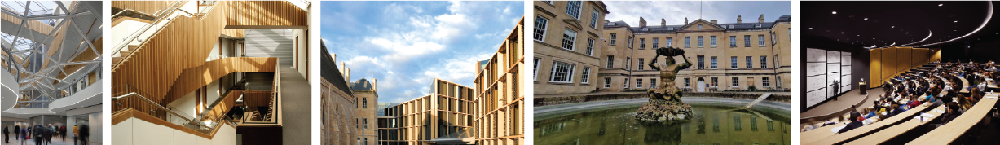
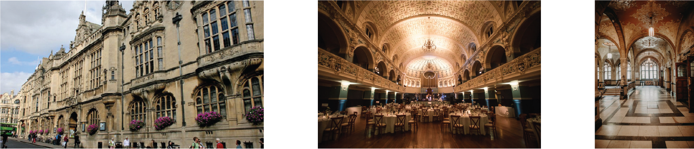

{:.center-image width=100%}

# Venues

### Main conference venue

QCTiP 2026 will be held at the **Mathematical Institute of the University of Oxford**, one of the world's oldest and most prestigious universities, located in the historic city of Oxford, United Kingdom.

The Andrew Wiles building is home to the Mathematical Institute and has been
named after Sir Andrew Wiles who proved Fermat's Last Theorem.

{:.center-image width=100%}

### Banquet dinner

The QCTiP 2026 banquet dinner will be held in the Oxford Town Hall which is a beautiful listed building located in the heart of Oxford. 

{:.center-image width=100%}

# Travel Information

### About Oxford

Oxford is a beautiful city with over 1,000 years of history, world-class museums, stunning architecture, and a vibrant cultural scene. The city is easily accessible from London and other major UK cities.

### Getting to Oxford

**By Air:**
- London Heathrow Airport (approximately 1 hour by coach)
- London Gatwick Airport (approximately 2 hours)
- Birmingham Airport (approximately 1 hour by train)

**By Train:**
- Direct trains from London Paddington and Marylebone stations (approximately 1 hour)
- Regular services from Birmingham, Manchester, and other major UK cities

**By Car:**
- Oxford is well-connected by the M40 motorway
- Parking is very limited in the city centre

### Local Transportation

- Excellent bus services throughout the city
- Taxi and ride-sharing services available
- Walking and cycling are popular ways to explore Oxford

### Finding Accommodation in Oxford

Please refer to [Registration](/registration) for information about recommended hotels and accommodation options.

**Important notice:** A major event, the [Skoll World Forum](https://skoll.org/) will take place later the same week as QCTiP 2026 in central Oxford.
While Skoll does not directly affect the main QCTiP event in the Mathematical Institute, accommodation will be more difficult to find
for the night of Tuesday the 21st April and after. For this reason we **strongly recommend that participants purchase a ticket for QCTiP as soon as possible
and then book accommodation immediately after purchasing a ticket**. 

### Things to Do in Oxford

- Visit the historic Oxford colleges
- Explore the Bodleian Library
- Tour the Ashmolean Museum
- Punt on the River Cherwell
- Walk through the Oxford Botanic Garden
- Discover the History of Science Museum

