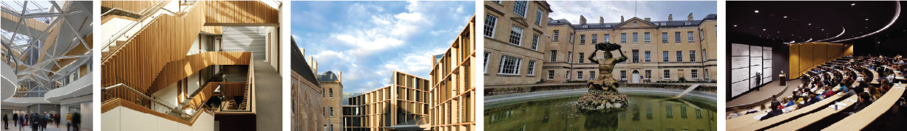
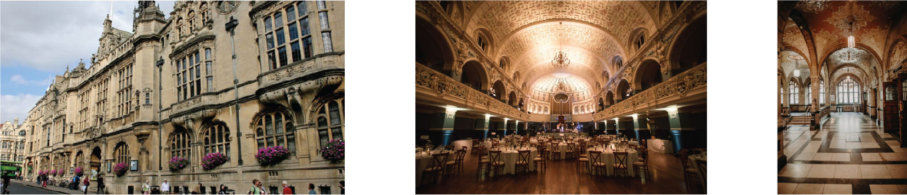

{:.center-image}

# Venue

### Conference Venue

QCTiP 2026 will be held at the **University of Oxford**, one of the world's oldest and most prestigious universities,
located in the historic city of Oxford, United Kingdom. Oxford is home to one of the most significant quantum centres
within the UK and even globally, with more than 60 groups conducting research in quantum technologies.

The conference will be held in the the **Andrew Wiles Building** which is home to the **Mathematical Institute** and has been
named after Sir Andrew Wiles who proved Fermat's Last Theorem.

The modern Andrew Wiles Building offers world-class facilities and is located centrally in Oxford, 
surrounded by a concentration of science departments (Physics, Computer Science, Materials, Engineering, Chemistry)
that conduct world-leading research in all aspects of quantum technologies. 

{:.center-images}

### Banquet Dinner

The QCTiP 2026 banquet dinner will be held in the **Oxford Town Hall** which is a beautiful listed building located in the heart of Oxford. 

{: style="width:60%;" .center-image}

### Near the Venue

- (less than 1 min walk) The major development project, the Schwarzman Centre for the Humanities building has just opened and
participants can enjoy its public spaces and its cafe

- (3 min walk)  The MI is located at the heart of the lively Jericho district of Oxford which has a broad range of
restaurants, pubs and cafes where participants can explore various breakfast and dinner options

- (less than 5 min walk) other science departments

# Travel Information

### About Oxford

Oxford is a beautiful city with over 1,000 years of history, world-class museums, stunning architecture, and a vibrant cultural scene.
The city is very well connected by rail with major UK and EU cities and easily accessible from 3 major airports. Most University buildings and Colleges are within walking distance.

**Things to Do in Oxford**

- Visit the historic Oxford colleges
- Explore the Bodleian Library
- Tour the Ashmolean Museum
- Punt on the River Cherwell
- Walk through the Oxford Botanic Garden
- Discover the History of Science Museum

**See suggested walking routes below.**

### Where to Eat in Oxford

**Restaurant Suggestions in the City Centre**
- The Ivy Oxford Brasserie – British classics in elegant setting
- Quod Restaurant & Bar – Brasserie dining on the High Street
- Dishoom Permit Room – Indian small plates & lively atmosphere
- No.1 Ship Street – Contemporary European dining
- Thaikhun Thai Restaurant – Larger Thai option with a fun atmosphere for groups.

**Jericho Area**
- Pierre Victoire – Relaxed French bistro (good for groups)
- Branca – upscale contemporary buzzy Italian
- Kibou – Japanese restaurant, be sure to try the signature Volcano roll.
- Popina by Lynrace - wine, cheese and charcuterie bar inspired by the popinae of Ancient Rome and the history of Oxford's Jericho district

**North Oxford / Woodstock Road Area**
- Gees Restaurant & Bar – Mediterranean cuisine
- Parsonage Grill – Modern British dining
- Scenic / Riverside
- Cherwell Boathouse – Riverside dining & punting available
- Ashmolean Rooftop Restaurant – Views across Oxford

**Independent**
- Visit the many outlets within the vibrant independent covered market such as sushi, pizza, wine bars, coffee shops and more.  Gulp bookshop offers a free coffee with every book purchased.
- Vaults & Garden – Popular café near the Covered Market

**Tim Chan** is an Oxford-based DPhil student and "food enthusiast".
He kindly prepared [THIS](https://maps.app.goo.gl/Us58V45xaXWUTVYj7?g_st=i)
collection of recommended places where participants can find delicious meals outside of the main conference venue.

### Getting to Oxford

**By Air:**
- London Heathrow Airport (approximately 1 hour by coach)
- London Gatwick Airport (approximately 2 hours)
- Birmingham Airport (approximately 1 hour by train)

**By Train:**
- Direct trains from London Paddington and Marylebone stations (approximately 1 hour)
- Regular services from Birmingham, Manchester, and other major UK cities

**By Car:**
- Oxford is well-connected by the M40 motorway
- Parking is very limited in the city centre

### Getting Into Oxford City Centre
**From Holiday Inn & Travelodge (Peartree Roundabout):**
- Use Pear Tree Park & Ride bus service to Gloucester Green (approx. 10–15 minutes).
- Buses run frequently throughout the day.
- Taxis into central Oxford take approx. 10–15 minutes (traffic dependent).

**From Mathematical Institute & St Anne’s College:**
- 15–20 minute walk down Woodstock Road into the city centre.
- Regular buses run along Woodstock Road (5–10 minutes into town).

### Central Oxford Highlights -- Suggested Walking Route (2–3 Hours)
**Start: Gloucester Green / Broad Street**
The following central attractions are within 10–15 minutes’ walk of each other.
- Broad Street – Sheldonian Theatre & Bodleian Library
- Radcliffe Camera & Radcliffe Square
- High Street & Queen Street (shops & cafés)
- Christ Church Meadow (riverside green space)
- Oxford Botanic Garden (near Magdalen Bridge)
- Optional: University Parks (pleasant scenic walk)

### Finding Accommodation in Oxford

Please refer to [Registration](/registration) for information about recommended hotels and accommodation options.

**Important notice:** A major event, the [Skoll World Forum](https://skoll.org/) will take place later the same week as QCTiP 2026 in central Oxford.
While Skoll does not directly affect the main QCTiP event in the Mathematical Institute, accommodation will be more difficult to find
for the night of Tuesday the 21st April and after. For this reason we **strongly recommend that participants purchase a ticket for QCTiP as soon as possible
and then book accommodation immediately after purchasing a ticket**. 

